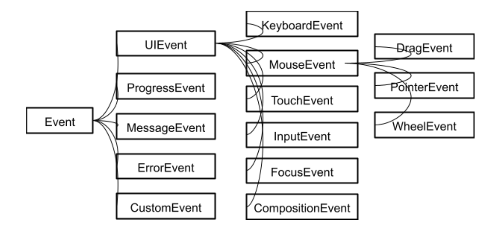
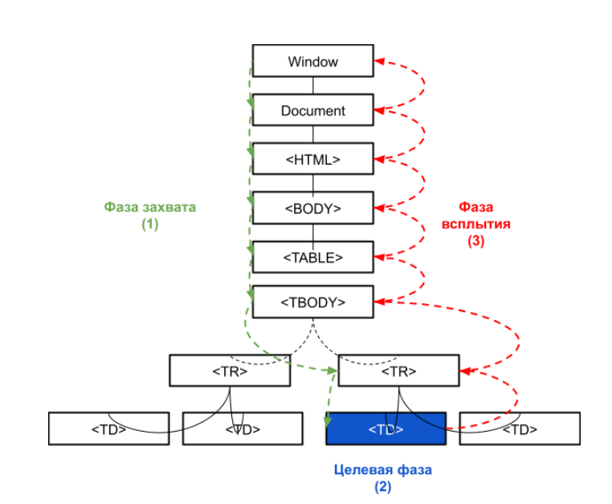

# JavaScript Event Basics

## DOM Events

Events are signals from the browser or other JavaScript runtime. These signals are used in the DOM to notify JavaScript code that actions of interest have occurred. Events are raised by user actions (filling out and submitting a form, clicking a button, moving the mouse, resizing the window) or because the following has changed:

- the state of the page (it has finished loading, an error has occurred);
- something in the underlying environment (low battery, media events from the operating system);
- something else.

The list of possible DOM events is very long. Here are just a few examples:

- click — clicking a mouse button
- touch — touching
- load — loading
- drag — dragging
- change — changing
- input — entering
- error — error
- resize — resizing
- contextmenu — opening a menu
- submit — submitting a form

Events are triggered for any part of the document as a result of interaction with it by the user or browser. These signals do not simply start and end in one place, they circulate throughout the document, going through their own life cycle. This is what makes DOM events so flexible and useful. Developers should understand how DOM events work in order to use their potential to build usable and functional interfaces.

Each event is an object that is based on the Event interface and has additional fields and/or functions that allow you to get additional information about what happened.



In order for JavaScript code to know about the occurrence of a particular event, we need to subscribe to this event. Subscribing to an event, which we will consider below, consists of adding a listener (handler) for the event. A listener is a function or a function body in the form of a string.

Let's consider adding listeners for some user and browser events using an example:

```html
<button onclick="counter++;console.log(counter)">Increment counter</button>
<script>
  let counter = 5;
  window.onload = () => {
    console.log("The page with all resources has been fully loaded.");
  };
  document.addEventListener("DOMContentLoaded", () => {
    console.log("DOM tree construction completed.");
  });
  const mouseEventListener = (event) => {
    console.log(event.type, event.clientX, event.clientY);
  };
  document.addEventListener("click", mouseEventListener);
  document.addEventListener("dblclick", { handleEvent: mouseEventListener });
  document.addEventListener("contextmenu", mouseEventListener, true);
  document.addEventListener("mouseenter", mouseEventListener, true);
  document.addEventListener("mouseleave", mouseEventListener, true);
  const throttle = (func, wait = 0) => {
    let ticking = false;
    return (...args) => {
      if (!ticking) {
        window.setTimeout(() => {
          func(...args);
          ticking = false;
        }, wait);
        ticking = true;
      }
    };
  };
  document.addEventListener(
    "mousemove",
    throttle(mouseEventListener, 300),
    true
  );
</script>
```

The presented code prints a message to the console when the DOM tree is built and when the page has fully loaded. It also prints the event type and the mouse position for some custom MouseEvent events. We will go through the methods used in the example in more detail below. Since the mousemove event fires too often, we wrote additional code to reduce the number of handler calls using the throttling pattern.

## DOM Event Architecture

Let's take a quick look at the event dispatch mechanism and how events propagate through the DOM tree:



Event objects are dispatched to an event target. But first, before dispatching, an event object's propagation path must be defined.

A propagation path is an ordered list of the current event targets through which it passes. The propagation path reflects the hierarchical tree structure of the document. The last item in the list is the event target, the previous items in the list are called the target's ancestors, and the immediately preceding item is the target's parent.

After the propagation path is defined, the event object passes through one or more event phases. There are three event phases: the capture phase, the target phase, and the bubbling phase. A phase will be skipped if it is not supported or the event object's propagation has stopped. For example, if the bubbles attribute is set to false, the bubbling phase is skipped. And if the stopPropagation() method was called before dispatching, all phases are skipped. Capturing phase — the event object propagates through its ancestors: from the window to the target's parent.

Target phase — the event object arrives at the event target. This phase is also known as the hitting-the-target phase. If the event type specifies that the event does not bubble, the event object will stop after this phase is complete.

Bubbling phase — the event object propagates through the target's ancestors in reverse order, starting from the target's parent and ending at the window.

Important! Not all events in the DOM bubble. For example, focus, blur, load, unload, change, reset, scroll, mouseenter, mouseleave events do not bubble. To find out whether an event bubbles, use the Event.bubbles boolean field.

## Comparison of different event goals

The following table shows the most common goals for events:

| Property      | Defined by interface  | Description                                                                                                                     |
| ------------- | --------------------- | ------------------------------------------------------------------------------------------------------------------------------- |
| event.target  | DOM Event             | The original DOM element on which the event                                                                                     |
| event.current | Target DOM Event      | The current DOM element whose subscribers are currently being processed. As events are captured and bubbled, this value changes |
| event.related | Target DOM MouseEvent | Defines the secondary target of the event                                                                                       |

For some mouse event pairs, there is an additional element associated with the original element where the mouse cursor was located before the event.

| Event type                       | event.target                   | event.relatedTarget            |
| -------------------------------- | ------------------------------ | ------------------------------ |
| mouseover, mouseenter, dragenter | Element that the cursor enters | Element that the cursor exits  |
| mouseout, mouseleave, dragleave  | Element that the cursor exits  | Element that the cursor enters |

## Adding an event listener

There are several ways to add listeners to an event. We're already familiar with the onclick attribute - let's look at some more.

## Using a DOM object property

To assign a handler, use the on<event> property of a DOM element.

For example, button.onclick:

```html
<button>Click me!</button>
<script>
  const button = document.querySelector("button");
  button.onclick = (event) => {
    console.log(event.target === button);
  };
</script>
```

This method replaces the current click event listeners, if any. The same works for other events and their associated handlers, such as blur (onblur), keypress (onkeypress), and so on. To remove a handler, assign button.onclick
= null.

These methods are widely supported and do not require special cross-browser code, however, they are archaic, inconvenient, and feature-limited.

## Using the addEventListener Method

The addEventListener method is a modern way of adding event listeners.

Unlike the methods described above, it:

- fires on any DOM element, not just HTML elements;
- adds multiple handlers for a single event;
- provides precise control over the phase of handler execution (invocation) (capture or bubbling).

For historical reasons, the addEventListener method supports two syntax variants.

```JavaScript
target.addEventListener(type, listener[, options])
target.addEventListener(type, listener[, useCapture])
```

In older versions of the DOM specification, the third parameter of addEventListener was a boolean value indicating whether to subscribe to the event during the capture phase.

Over time, it became clear that more options were needed. Rather than adding additional parameters to the function, complicating things when using optional values, the developers replaced the third parameter with an object that contains properties that define the parameter values ​​for configuring the event handler.

To remove a handler, use the removeEventListener method with a similar syntax:

```html
<button>Click me!</button>
<script>
  const button = document.querySelector('button')
  const onceListener = () => {
  console.log('Will be called only once with the "once" option enabled')
  }
  const onceListenerManual = (event) => {
  console.log('Will be called only once and removed manually by calling
  removeEventListener')
  event.target.removeEventListener('click', onceListenerManual)
  }
  button.addEventListener('click', onceListener, {once: true})
  button.addEventListener('click', onceListenerManual)
</script>
```

As we can see, it is more convenient to use the once option to add a handler that is automatically removed after the first fire.

## Multiple identical event handlers

If multiple identical EventListeners with the same parameters are registered on one EventTarget, the duplicate handlers are ignored. The example below contains two identical handlers for the capture phase, one of which will be ignored:

```html
<button>Click me!</button>
<script>
  const button = document.querySelector("button");
  const listener = (event) => {
    switch (event.eventPhase) {
      case Event.CAPTURING_PHASE: {
        console.log("Will be called during the capturing phase");
        break;
      }
      case Event.BUBBLING_PHASE: {
        console.log("Will be called during the bubbling phase");
        break;
      }
      case Event.AT_TARGET: {
        console.log("Will be called in the target phase");
        break;
      }
    }
  };
  document.addEventListener("click", listener); // Bubbling phase
  document.addEventListener("click", listener, true); // Capture phase (capturing phase)
  document.addEventListener("click", listener, { capture: true }); // Capture phase (capturing phase)
  button.addEventListener("click", listener); // Target phase
</script>
```

## Event Delegation

A common task is to assign a single event handler to multiple nodes of the same type, for example, the DOM elements of an <li> list. In this case, instead of getting references to all the <li> in the list, looping through them, and assigning a listener to each, it makes sense to assign only one listener to the parent <ul> element. This technique is called event delegation and is widely used in front-end development.

Delegate uses the event.target property to access the target element of the event. The event.currentTarget property will point to the element to which we delegated the handler:

```html
<ul>
  <li>First</li>
  <li>Second</li>
  <li>Third</li>
</ul>
<script>
  const list = document.querySelector("ul");
  const listener = (e) => {
    console.log(e.target, e.currentTarget);
  };
  list
    .addEventListener("click", listener)
    [("fourth", "fifth")].forEach((text) => {
      const listItem = document.createElement("li");
      listItem.append(text);
      list.append(listItem);
    });
</script>
```

## Practice

### Task one

1. In html create a button

```html
<button class="button">Click me!</button>
```

2. After the page loads, display the text “page loaded” in the console

```JavaScript
        const buttonEl = document.querySelector('.button');
        const bodyEl = document.querySelector('body');


        buttonEl.addEventListener('click', (e) => {
            console.log(e.target, e.currentTarget, e.bubbles, e.cancelable, e.cancelBubble);
        });

        bodyEl.onload = function () {
            console.log('Loaded');
        }

        window.addEventListener('load', (event) => {
            console.log('Loaded');
        });
```

3. Add an onclick event that displays the text “onclick event” in the console

```JavaScript
    buttonEl.onclick = (e) => {
            console.log('Clicked');
        }
```

4. Add an addEventListener event that displays the text “addEventListener event” in the console

```JavaScript
    buttonEl.addEventListener('click', (e) => {
            console.log('Clicked');
        })
```

### Task two

1. Create three buttons in html with numbers (1, 2, 3 respectively)

```html
<button class="button">1</button>
<button class="button">2</button>
<button class="button">3</button>
```

2. Add a click on the button so that the console displays exactly the button we clicked on

```JavaScript
 const buttons = document.querySelectorAll('.button');
        buttons.forEach((button) => {
            button.addEventListener('click', (e) => {
                console.log(e.currentTarget);
            });
        });
```

3. Add a button with text 4, which counts how many times it was clicked and displays the number of clicks on this button in the console

```JavaScript
const buttonTwo = document.querySelector('.button-two');
        let count = 0;
        buttonTwo.addEventListener('click', (e) => {
            console.log(++count);
        });
```

4. Create a button with text 5, When clicked on, the text of this button changes to “You clicked on this button”

```JavaScript
const buttonThree = document.querySelector('.button-three');
        buttonThree.addEventListener('click', (e) => {
            buttonThree.textContent = 'You clicked on this button';
        });
```

### Task three

1. Create a button that adds an h1 heading with the text, “New heading, this element needs to be placed after the button

```html
<button class="button">Add heading!</button>
<h1 class="heading"></h1>

<script>
  const button = document.querySelector(".button");
  const heading = document.querySelector(".heading");
  button.addEventListener("click", (e) => {
    heading.insertAdjacentHTML(
      "afterend",
      '<h1 class="new-heading">New heading</h1>'
    );
  });
</script>
```

2. Create a second button that will delete the created h1 heading

```html
<button class="delete-button">Delete heading!</button>

<script>
  const buttonDel = document.querySelector(".delete-button");
  buttonDel.addEventListener("click", (e) => {
    const newHeading = document.querySelector(".new-heading");
    if (newHeading) {
      newHeading.remove();
    }
  });
</script>
```

3. Create a third button, when hovering over which the text “you hovered over this button” will be displayed in the console, as soon as you remove the mouse cursor from the button, the text “There is no longer a hover over the button” should appear in the console

```html
<button class="hover-button">Hover over me!</button>

<script>
  const buttonHover = document.querySelector(".hover-button");
  buttonHover.addEventListener("mouseenter", (e) => {
    console.log("You hovered over this button");
  });
  buttonHover.addEventListener("mouseleave", (e) => {
    console.log("There is no longer a hover over the button");
  });
</script>
```

### Task four

1. Create a list in html consisting of 3 arbitrary li elements

```html
<ul class="list">
  <li>First</li>
  <li>Second</li>
  <li>Third</li>
</ul>
```

2. You need to create a button that will add list elements with the text “new list element”

```html
<button class="add-button">Add list element</button>

<script>
  const buttonAdd = document.querySelector(".add-button");
  const list = document.querySelector(".list");
  buttonAdd.addEventListener("click", (e) => {
    const li = document.createElement("li");
    li.textContent = "New list element";
    list.append(li);
  });
</script>
```

3. Create a button that will delete the last element from the list

```html
<button class="delete-button-last">Delete last list element</button>

<script>
  const buttonDelLast = document.querySelector(".delete-button-last");
  buttonDelLast.addEventListener("click", (e) => {
    const li = list.lastElementChild;
    if (li) {
      li.remove();
    }
  });
</script>
```

4. Create a button that will delete the first element from the created list

```html
<button class="delete-button-first">Delete first list element</button>

<script>
  const buttonDelFirst = document.querySelector(".delete-button");
  buttonDelFirst.addEventListener("click", (e) => {
    const li = list.firstElementChild;
    if (li) {
      li.remove();
    }
  });
</script>
```

5. Create a button that, when clicked, adds the class “click” to it

```html
<button class="button">Click me!</button>

<script>
  const button = document.querySelector(".button");
  button.addEventListener("click", (e) => {
    button.classList.add("click");
  });
</script>
```

### Homework

Given the [HTML](./homework.html) markup.

#### Task

Tasks:

1. It is necessary to display a message in the console "all tags loaded" when all tags are created by the browser.
2. It is necessary to display a message in the console "page loaded" when all page resources are loaded.
3. When clicking on any tag on the page, the following message should be displayed in the console:

- The "super_element" class is present in the "div" element.
- The message should determine whether the "super_element" class is present in the element and display the correct tag in lowercase in this line, on which the click was made.
- Delegation must be used.

4. Make it so that when hovering over <textarea>, the following message appears in the console:
   "You hovered over textarea."
5. It is necessary to hang a click event on the <ul> tag. In the event handler, display the text in the console, which is written inside the button element on which the click was made. If the click was not on the button, then nothing should be output.
   It is necessary to use delegation.
6. Question: Why is the text from task 5 written first in console.log and only then the text from task 3, if we click on the buttons in <ul>? The answer should be written here, under this comment, in your own words.
7. Using JS, it is necessary to change the background color of every second tag <li>.
