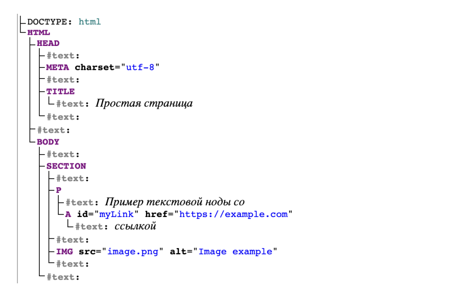
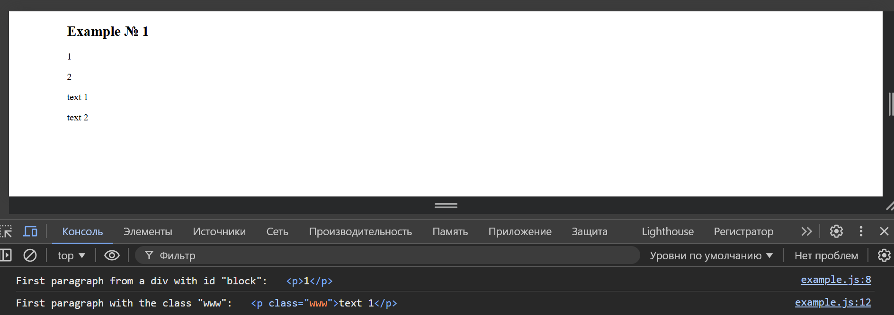
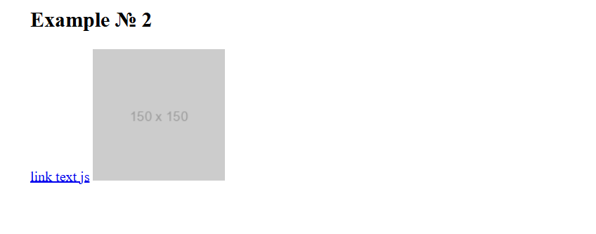
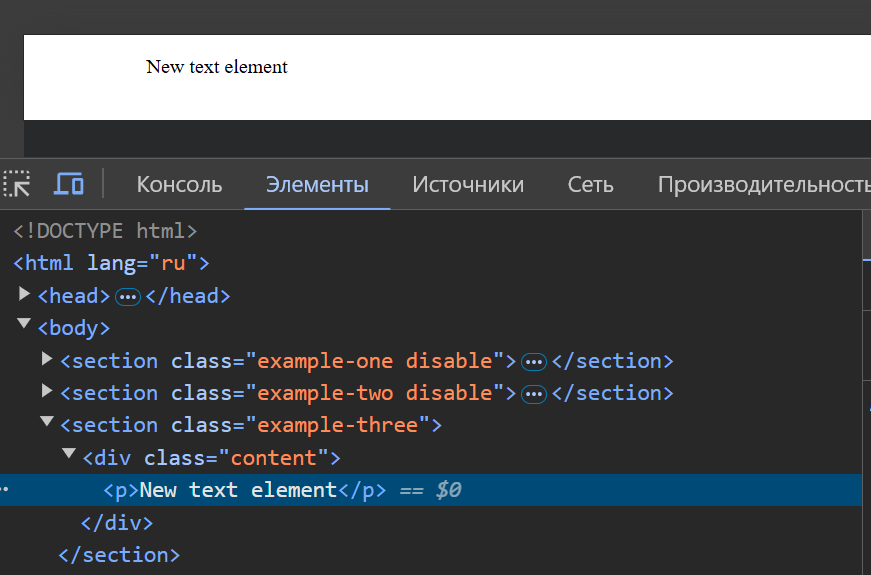
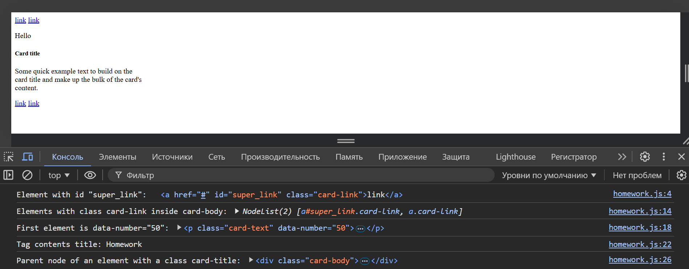

# Introduction to DOM (Document Object Model)

The document loaded in each browser tab is represented by the Document Object Model (DOM).

This is a "tree structure" representation created by the browser. It allows the HTML structure to be easily accessed using programming languages. For example, the browser itself uses it to apply style and other information to relevant elements as it renders the page. Developers manipulate the DOM using JavaScript after the page has been rendered.

Using the online tool [Live DOM Viewer](https://software.hixie.ch/utilities/js/live-dom-viewer/), you can see what this page looks like as a tree of DOM elements:


We see that each HTML element and text in the document has its own entry in the tree
— each of these is called a node. The terms used to describe a node and its position in the tree
are:

1. Element node — an element as it exists in the DOM.
2. Root node — the top node in the tree, which in the case of HTML is always an HTML node.
3. Child node — a node that is directly inside another node. So, IMG in the
   example above is considered a child of SECTION.
4. Descendant node — a node inside a child. So, IMG in the
   example above is considered a child of SECTION and a descendant of SECTION's parent. IMG is not a child of BODY, as it is two levels below the tree in the tree, but it is considered a descendant of BODY.
5. Ancestor node is one of the parent nodes of the parent of the current
   node. Any node that the current node is a descendant of is its
   ancestor.
6. Parent node is the node that the current node is a child of. For example, BODY is the parent node of SECTION in the example above.
7. Sibling nodes are nodes that are at the same level in the DOM tree.
   For example, IMG and P are siblings in the example above.
8. Text node is a node that contains a text string.

## Basics of Manipulating the DOM Structure

Let's add a `<script></script>` element just before the closing `</body>` tag. To manipulate an element within the DOM, we first need to select it and then store a reference to it in a
variable. Let's add the following line to our script element:

```html
<!DOCTYPE html>
<html lang="ru">
  <head>
    <meta charset="UTF-8" />
    <meta name="viewport" content="width=device-width, initial-scale=1.0" />
    <title>Document</title>
    <link rel="stylesheet" href="style.css" />
  </head>
  <body>
    <section>
      <p>Text node with <a id="myLink" href="https://example.com">link</a></p>
      
    </section>
    <script>
      const link = document.querySelector("a");
    </script>
  </body>
</html>
```

JavaScript has many ways to select an element and store a pointer to it in a
variable. [Document.querySelector()](https://developer.mozilla.org/ru/docs/Web/API/Document/querySelector) is the recommended modern approach, and is considered convenient because it allows you to select elements using CSS selectors.
The above `querySelector()` matches the first link element that
appears in the document.

To do something with multiple elements, `Document.querySelectorAll()` is used. It
selects all elements that match the selector and stores references to them in a
NodeList collection of elements.

There are older methods for capturing references to elements. For example:

1. `Document.getElementById()` selects the element with the given id attribute value —
   passed to the function as a parameter.
2. `Document.getElementsByTagName()` returns an HTMLCollection
   containing all the elements on the page of that type — passed to the function as a parameter. For example, text paragraph, link, etc.
3. `Document.getElementsByClassName()` returns an HTMLCollection of child elements that match all the specified class names — passed to the function as a parameter. For example, 'class-one class-two', etc.

These three methods work in older browsers than modern methods such as
`querySelector()`. But they are not as convenient, since the syntax of CSS selectors is more flexible and
allows you to specify complex search criteria.
All the described methods are also called, in relation to any element: only those elements that are considered descendants of the specified root element and
satisfy the search conditions, i.e. have the specified tags, classes and id, are returned.
In this example, all variants return the same link element:

```js
let link;
link = document.querySelectorAll("a")[0];
link = document.querySelector("#myLink");
link = document.getElementById("myLink");
link = document.getElementsByTagName("a")[0];
```

So now that we have a reference to the element stored in a variable, we can begin to
manipulate it using the properties and methods available to the element. These properties and methods
are defined on interfaces such as HTMLAnchorElement, in the case of link, its parent HTMLElement
interface, and Node, which represents all the nodes in the DOM.

First, let's change the text inside the link by updating the value of the Node.textContent property.
Add the following line below the previous one:

```js
link.textContent = "New text";
```

We can also change the URL that the link points to so that it doesn't go to the wrong place when clicked.

Let's add the following line:

```js
link.href = "https://example.com/new-link";
```

## Creating and adding new nodes

Returning to the current example, let's start by getting a reference to our section element.

Add the following code to the bottom of the existing script:

```js
const sectionElement = document.querySelector("section");
```

Now let's create a new paragraph using `Document.createElement()` and pass it the text content as before:

```js
const paragraphElement = document.createElement("p");
paragraphElement.textContent = "New text";
```

Let's add a new paragraph to the end of the section using `Node.appendChild()`:

```js
sectionElement.appendChild(paragraphElement);
```

Let's add an extra text node to our new paragraph.
First, let's create a text node using `Document.createTextNode()`.

Now, let's take a reference to the paragraph and add an extra text node to it:

```js
const paragraphElementText = document.createTextNode("Contents of a text node");
paragraphElement.appendChild(paragraphElementText);
```

## Cloning nodes

Once a node has been added to the tree, adding it again to a different parent removes it from the current one.

To copy a node, use the `Node.cloneNode(deep)` method. It
returns a duplicate of the node from which this method is called. The method takes a single
boolean parameter, deep, which determines whether the node's children should be cloned.

Cloning nodes copies all attributes and their values, including event listeners
added using HTML attributes, such as `<button onclick="...">`.

Event listeners added using the addEventListener() method or assigned via element properties, such as `node.onclick = fn`, are copied.

A duplicate node returned by `.cloneNode()` is not considered part of the document and has no
parent until it is added to another node, such as part of the document, using `Node.appendChild()` or another method.

If deep is false (the default), child nodes, including text nodes, are not cloned.

If deep is true, all subtrees, including text, are also copied. For empty nodes, i.e. `` and `<input>` elements, it does not matter whether deep is true or false.

Important! cloneNode() sometimes results in duplicate element IDs in the document.

If the original node has an ID (id attribute), and the clone is placed in the same document, the ID is changed to be unique. The name attribute also needs to be
changed.

```js
const sectionElement = document.querySelector("section");
const sectionElementClone = sectionElement.cloneNode(true);
const link = sectionElementClone.querySelector("#myLink");
link.id = "myLinkClone";
document.body.appendChild(sectionElementClone);
```

## Removing nodes

There are two ways to remove a node from the DOM:

- via a reference to the parent element, using parentNode.removeChild(child);
- using the Element.remove() method.

Let's remove the previously created section clone:

```js
const sectionElementClone = document.querySelectorAll("section")[1];
sectionElementClone.parentNode.removeChild(sectionElementClone);
// sectionElementClone.remove()
```

## Replacing nodes

The DOM API contains methods for replacing one node with another or multiple nodes. As with
removal, two different methods are available:

- via a reference to the parent element, using parentNode.replaceChild(newChild,oldChild);
- using the Element.replaceWith(...nodes) method

```js
const divElement = document.createElement("div");
const paragraphElement = document.createElement("p");
divElement.appendChild(paragraphElement);
const spanElement = document.createElement("span");
const strongElement = document.createElement("strong");
paragraphElement.replaceWith(spanElement, strongElement);
console.log(divElement.outerHTML);
```

## Working with properties and methods

```html
<div class="product">
  
  <h3>T-shirt name</h3>
  <p>
    Lorem ipsum dolor sit, amet consectetur adipisicing elit. Sequi, reiciendis!
  </p>
  <button class="button">Buy</button>
</div>
```

```js
const buttonEl = document.querySelector(".button");
const productImg = document.querySelector(".product__img");
productImg.onclick = function () {
  productImg.src = "img/photo2.jpg";
};
buttonEl.onclick = function () {
  buttonEl.textContent = "Product added to cart";
};
```

In this example, we have a product block, which contains an image of the product, a title, a description, and a buy button.

Our task is to make it so that when you click on the image, a new image appears, and when you click on the drink button, the button text changes to “Product added to cart”.

First of all, we need to find the elements we will work with, for this we use the construction

```js
const buttonEl = document.querySelector(".button");
const productImg = document.querySelector(".product__img");
```

Next, we need to add an onclick handler to each of these elements Using the knowledge from our lesson, we can use the `.textContent` method which allows us to change the text values ​​inside the tag, now when you click on the button the text will change.

Similarly, we will add the .src method, which will help us change the product image when you click on it.

## [Pseudo arrays](https://habr.com/ru/articles/336136/)

## Examples

### Example № 1

1. Get link to first paragraph from div with id block, output it to console
2. Get link to first paragraph with class www and output it to console

To solve problems we will use [index.html](index.html)

For both tasks we use `document.querySelector()` method in [javascript](js/example.js) file.



### Example № 2

1. We have tag `<a class="link" href="#">`link text html`</a>`

   - need to change text inside link to “link text js”
   - Replace href with value https://developer.mozilla.org/ru/

2. We have tag ``

   - need to use js to change src value to any image from Internet

To solve these problems, we will intercept necessary elements into variable, with help of which we will access necessary attributes.

```js
const link = document.querySelector(".link");
link.textContent = "link text js";
link.href = "https://developer.mozilla.org/ru/";
```

```js
const img = document.querySelector(".photo");
img.src = "https://via.placeholder.com/150";
img.alt = "placeholder";
```



### Example № 3

1. Given tag `<div class="content"></div>`
2. Create a new element `p`
3. Add text “New text element” to it
4. Add created element inside `<div class="content"></div>`
5. Delete added node

- Create a new element `<p>`

```js
const newParagraph = document.createElement("p");
```

- Add text "New text element" to new element

```js
newParagraph.textContent = "New text element";
```

- Add created element inside `<div class="content">`

```js
const contentDiv = document.querySelector(".content");
contentDiv.appendChild(newParagraph);
```



- Remove added element

```js
contentDiv.removeChild(newParagraph);
```

### Example № 4

1. Create button element, add it to block `<div class="content"></div>`
2. When clicked, number of times user clicked on this button is displayed in console

- Create button element and setting button text

```js
const button = document.createElement("button");
button.textContent = "Click me";
```

- Add button to `<div class="clicker-content">` block

```js
const contentDiv = document.querySelector(".clicker-content");
contentDiv.appendChild(button);
```

- Variable to track number of clicks

```js
let clickCount = 0;
```

- Add button click event handler and put number of clicks to console

```js
button.addEventListener("click", function () {
  clickCount++;
  console.log("Number of button click:", clickCount);
});
```

### Example № 5

- We have tag `<div class="content"></div>`
- Create a new button element using javascript
- Add text for the “Send” button
- When you click on this button, the text should change to “Text sent”

- Create new button element

```js
const button = document.createElement("button");
```

- Add text for "Send" button

```js
button.textContent = "Send";
```

- Add a button to <div class="sender-content"> block

```js
const contentDiv = document.querySelector(".sender-content");
contentDiv.appendChild(button);
```

- Add button click event handler and change button text to "Text sent"

```js
button.addEventListener("click", function () {
  button.textContent = "Text sent";
});
```

### Example № 6

We have [Homework](homework.html):

1. Find the element by id using getElementById, the element with the id equal to
   "super_link" and print this element to the console.
2. Inside all elements on the page that have the class card-link,
   change the text inside the element to "link".
3. Find all elements on the page with the class card-link that are inside
   the element with the class card-body and print the resulting collection to the console.
4. Find the first element on the page that has the attribute
   data-number with the value 50 and print it to the console.
5. Print the contents of the title tag to the console.
6. Get the element with the class card-title and print its parent node to the
   console.
7. Create a `<p>` tag, write the text "Hello" inside it and add the created
   tag to the beginning of the element that has the class card.
8. Remove the h6 tag on the page.

- Find the element by id "super_link" and output it to the console:

```js
const superLink = document.getElementById("super_link");
console.log('Element with id "super_link":', superLink);
```

- Change text inside all elements with class card-link to "link":

```js
const cardLinks = document.querySelectorAll(".card-link");
cardLinks.forEach((link) => {
  link.textContent = "link";
});
```

- Find all elements with card-link class inside an element with card-body class and output collection to console:

```js
const cardBodyLinks = document.querySelectorAll(".card-body .card-link");
console.log("Elements with class card-link inside card-body:", cardBodyLinks);
```

- Find first element with data-number attribute with value 50 and output it to the console:

```js
const dataNumberElement = document.querySelector('[data-number="50"]');
console.log('First element is data-number="50":', dataNumberElement);
```

- Output title to console:

```js
const titleContent = document.title;
console.log("Tag contents title:", titleContent);
```

- Get an element with class card-title and output its parent node to console:

```js
const cardTitle = document.querySelector(".card-title");
console.log(
  "Parent node of an element with a class card-title:",
  cardTitle.parentNode
);
```

- Create `<p>` tag, write text "Hello" and add it to beginning of element with class card:

```js
const newParagraph = document.createElement("p");
newParagraph.textContent = "Hello";
const cardElement = document.querySelector(".card");
cardElement.insertBefore(newParagraph, cardElement.firstChild);
```

- Remove h6 tag on the page

```js
const h6Element = document.querySelector("h6");
if (h6Element) {
  h6Element.remove();
}
```


