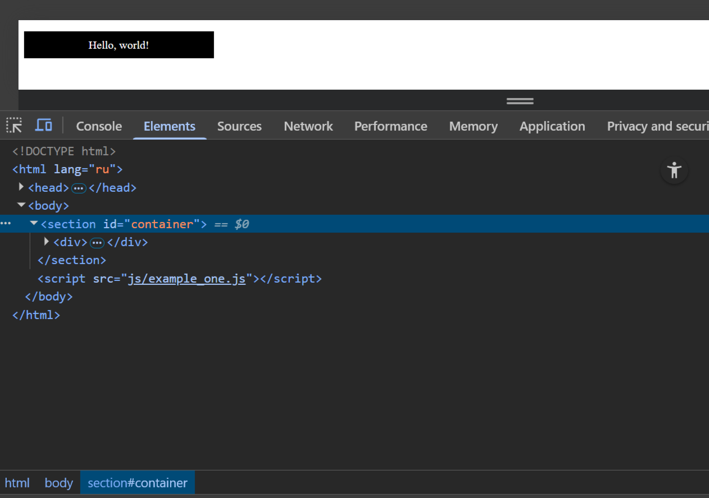
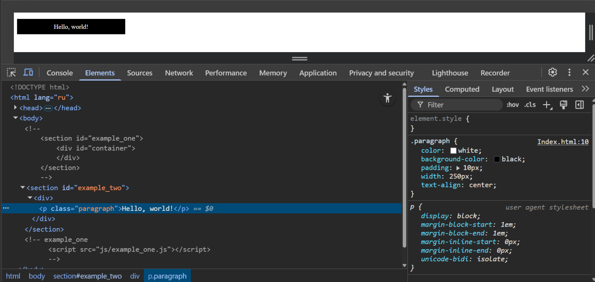
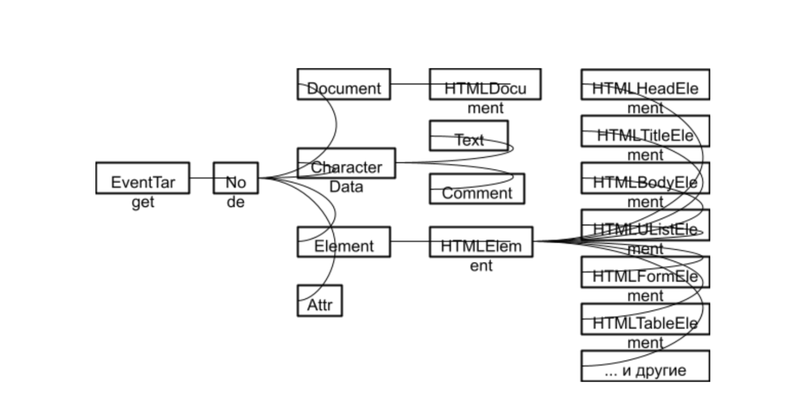
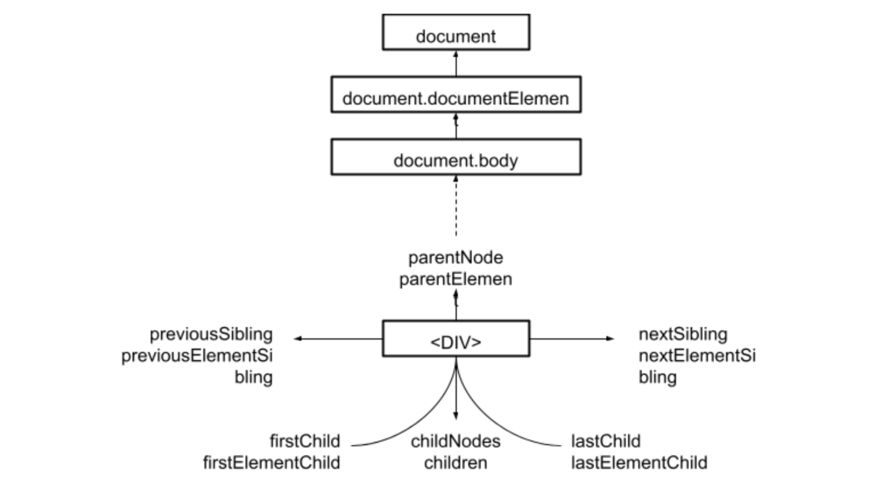
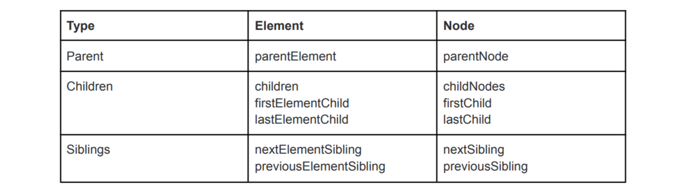

# Working with DOM

## Managing Styles

There are several ways to manage styles using JavaScript.

You can get a list of all style sheets attached to a document via Document.stylesheets, which returns an array of CSSStyleSheet objects. Styles are added or removed as desired. However, these functions are somewhat archaic and are considered a difficult way to manipulate styles. There are easier ways.
The first way is to add inline styles directly to the elements we want to dynamically style. This is done using the HTMLElement.style property. It contains inline style information for each element in the document. You can set properties of this object to directly update the styles of elements.

```JavaScript
// Create a new div and paragraph
const divElement = document.createElement('div');
const paragraphElement = document.createElement('p');

// Apply styles to the paragraph
paragraphElement.style.color = 'white';
paragraphElement.style.backgroundColor = 'black';
paragraphElement.style.padding = '10px';
paragraphElement.style.width = '250px';
paragraphElement.style.textAlign = 'center';

// Add text to the paragraph
paragraphElement.textContent = 'Hello, world!';

// Add the paragraph to the div
divElement.appendChild(paragraphElement);

// Find the container in the HTML and add the created div to it
const container = document.getElementById('container');
container.appendChild(divElement);
```

Reload the page and see that the styles are applied to the paragraph. If you look at this paragraph in your browser's inspector, you'll see that these lines actually add inline styles to the document:

```HTML
<p style="color: white; background-color: black; padding: 10px; width: 250px; text-align: center;"></p>
```



> Important! JavaScript versions of CSS style properties are written in lower camel case, while CSS style property versions use hyphens in kebab case. Examples: backgroundColor and background-color. Do not confuse them!

There is another common way to dynamically manage document styles.

Let's look at it.

1. Remove the previous five lines added to JavaScript.
2. Add the following content to the <head> element:

```HTML
<style>
.paragraph {
color: white;
background-color: black;
padding: 10px;
width: 250px;
text-align: center;
}
</style>
```



Now let's move on to a very useful method for general HTML manipulation - Element.setAttribute(). This method takes two arguments: the name and value of the attribute to set on the element.

Let's specify the name of the highlight class in our paragraph:

```JavaScript
paragraphElement.setAttribute('class', 'paragraph')
```

Setting the class attribute via the setAttribute method is not the only way, and perhaps not the most
idiomatic one. Modern browsers support the Element.className and more powerful and functional Element.classList properties.

Refresh the page and you will see the following changes: the CSS is still applied to the paragraph,
but this time it is set to the class that is selected by our CSS rule, and not via inline CSS styles.

You can choose whichever method you like: both have their advantages and disadvantages.

The first method takes less configuration and is good for simple use, while the second method is conceptually cleaner, i.e. without mixing CSS and JavaScript, without inline styles, which are considered a bad practice.

## Navigating through DOM tree elements

To understand the possibilities of navigating through DOM tree elements, let's look at the types of elements and what interfaces they implement.

### Hierarchy of DOM Interfaces

The DOM standards describe interfaces for different types of objects.

When we read documentation about the DOM and its implementation in JavaScript, it is useful to know a little about the DOM class hierarchy. This is necessary for searching the inheritance chain to
understand what attributes and methods a particular DOM element inherits.



As we can see, all HTML element (tag) classes are subclasses of HTMLElement. In turn, HTMLElement is a subclass of Element.

Node is the base class for all DOM interfaces, including the base class for Document. Node also has a parent, EventTarget, an interface implemented by objects that generate events and have subscribers to these events.

The DOM interface was designed as a universal interface not only for HTML, but for any XML document. HTMLDocument is an abstract DOM interface that provides access to special properties and methods that are not provided by default in a regular XML document.

### Collection Interfaces in DOM

Collections in DOM are represented by two basic interfaces. Let's consider them:


DOM elements implementing the Node interface also implement two additional interfaces: ParentNode and ChildNode.

The ParentNode interface contains methods specific to Node objects that may have children. And the ChildNode interface includes methods specific to Node objects that have a parent.

Thus, the Node interface can contain childNodes and children fields that implement two different interfaces: NodeList and HTMLCollection, respectively. These fields are read-only and represent collections or pseudo-arrays. In practice, this means that they contain a length field and support the interface for getting an element by index. But we cannot directly call array methods on them like filter, map, reduce, etc.

There are several differences between these collections:

1. NodeList includes any type of child nodes, such as HTMLElement, Text, Comment.
2. HTMLCollection contains only nodes of type HTMLElement, corresponding to HTML tags such as <div> and <p>, for which the nodeType field is 1.
3. NodeList can be either dynamic or static. For example, the childNodes field is a dynamic NodeList, while the NodeList returned by the Node.querySelectorAll method is considered static, meaning it does not update the length field when an element is added or removed from the DOM tree.
4. HTMLCollection is a dynamic collection of elements.

You can see that most collections are either arrays or objects. We need a simple way to pass values ​​to an array, for this there are spread and rest operators.

### Spread, rest operator

With the ES2015 standard, we have access to very useful tools for working with arrays: spread and rest operators, as well as destructuring.

#### Spread operator

Spread is an operator for spreading, or, in other words, spreading data from an array into atomic elements. We can take an array and pull out all its elements as separate variables. This is necessary when we want to pass multiple arguments to a function or move elements of one array to another. To do this, put an ellipsis before the array (spread operator). Let's look at some examples:

```JavaScript
const studentsGroup1PracticeTime = [
{
firstName: "Ivanov",
practiceTime: 56
},
{
firstName: "Petrov",
practiceTime: 120
},
{
firstName: "Sidorov",
practiceTime: 148
},
{
firstName: "Belkin",
practiceTime: 20
},
{
firstName: "Avdeev",
practiceTime: 160
}
];
const studentsGroup2PracticeTime = [
{
firstName: "Mankov",
practiceTime: 87
},
{
firstName: "Kistin",
practiceTime: 133
},
{
firstName: "Kotlyarov",
practiceTime: 140
},
{
firstName: "Peskov",
practiceTime: 10
},
];
// Let's write a not very convenient, but exponential function that can accept an unlimited number of arguments and find the maximum among them. The function should be called like this: const maximum = findMax(4, 7, 10);
function findMax() {
const values ​​= arguments; // arguments is a variable that is available inside each function and contains all the arguments passed to the function. It is a pseudo-array.
let maxValue = -Infinity;
// Since arguments is a pseudo-array, we cannot apply new array methods to it, such as forEach or reduce, but we will iterate the old-fashioned way.
for (let index = 0; index < values.length; index++) {
if (values[index] > maxValue) maxValue = values[index];
}
return maxValue;
};
// We only need to pass numbers to the functions, and our arrays contain objects, so first we'll create arrays with only the time values ​​of the students.
const group1PracticeTime = studentsGroup1PracticeTime.map((student) =>
student.practiceTime);
const group2PracticeTime = studentsGroup2PracticeTime.map((student) =>
student.practiceTime);
// Now we can call the function to find the maximum value. It takes many numeric arguments, and we only have an array - this is where the spread operator comes in.
const maxTimeFromGroup1 = findMax(...group1PracticeTime);
// ...group1PracticeTime will pull all the elements out of the array and pass them to the function as separate variables.
// This is similar to the ugly and awkward notation:
// findMax(group1PracticeTime[0], group1PracticeTime[1], group1PracticeTime[2],
group1PracticeTime[3], group1PracticeTime[4])
console.log(maxTimeFromGroup1); // 160
const maxTimeFromGroup2 = findMax(...group2PracticeTime);
console.log(maxTimeFromGroup2); // 140
// Let's also find the maximum time worked among the two groups. We can do this by passing the data of both arrays to the function like this:
// findMax(...group1PracticeTime, ...group2PracticeTime);
// Or we can combine the two arrays into one - this is a very common operation, and the spread operator is very helpful for this.
const bothGroupsTime = [...group1PracticeTime, ...group2PracticeTime];
// To merge two arrays, we need to pull their elements into one common array, so we declare a new array and make its elements an extension of the elements of the first and second arrays. We could also add other elements to it.
const maxTimeBothGroups = findMax(...bothGroupsTime);
console.log(maxTimeBothGroups); // 160
```

#### Rest-operator

The Rest operator allows you to collect the remaining arguments of a function into an array. It sounds a bit strange, but this operator allows you to not list all the arguments of a function as separate variables, but to get them all as one array. To use it, in a function that takes several arguments, you need to list the necessary arguments, and write all the remaining ones that you want to collect into one array as ... <array name>. Often they write ...rest. Let's rewrite our previous example using the rest operator and thereby get rid of the pseudo-array arguments.

```JavaScript
const studentsGroup1PracticeTime = [
{
firstName: "Ivanov",
practiceTime: 56
},
{
firstName: "Petrov",
practiceTime: 120
},
{
firstName: "Sidorov",
practiceTime: 148
},
{
firstName: "Belkin",
practiceTime: 20
},
{
firstName: "Avdeev",
practiceTime: 160
}
];
const studentsGroup2PracticeTime = [
{
firstName: "Mankov",
practiceTime: 87
},
{
firstName: "Kistin",
practiceTime: 133
},
{
firstName: "Kotlyarov",
practiceTime: 140
},
{
firstName: "Peskov",
practiceTime: 10
},
];
// Let's write a not very convenient, but exponential function that can accept an unlimited number of arguments and find the maximum among them. The function should be called something like this: const maximum = findMax(4, 7, 10);
function findMax(...values) {
// here we accept all the passed arguments and, using the rest operator, pack them into the values ​​array.
// This time, values ​​is a real array, and we can use reduce to iterate over it and find the maximum number.
return values.reduce((acc, value) => {
if (value > acc) return value;
return acc;
}, -Infinity);
};
// Let's create arrays with only the values ​​of the time worked by students.
const group1PracticeTime = studentsGroup1PracticeTime.map((student) =>
student.practiceTime);
const group2PracticeTime = studentsGroup2PracticeTime.map((student) =>
student.practiceTime);
// Call our max function using the spread operator.
const maxTimeFromGroup1 = findMax(...group1PracticeTime);
console.log(maxTimeFromGroup1); // 160
const maxTimeFromGroup2 = findMax(...group2PracticeTime);
console.log(maxTimeFromGroup2); // 140
// Let's also find the maximum time worked between the two groups.
const bothGroupsTime = [...group1PracticeTime, ...group2PracticeTime];
const maxTimeBothGroups = findMax(...bothGroupsTime);
console.log(maxTimeBothGroups); // 160
```

Now let's look at another example:

```JavaScript
const saveFullNameInDB = (firstName, lastName, ...additionals) => {
saveFirstName(firstName);
saveLastName(lastName);
saveAdditionals(additionals);
// Thanks to the rest operator, we were able to collect all the additional data that was passed to be saved in the database, and we can pass it as one array to the function for saving additional data.
}
```

### Working with collections

Let's create an HTML file ([index2.html](./index2.html)) with the following content and open it in a browser:

```HTML
<!DOCTYPE html>
<html>
<head>
<meta name="viewport" content="width=device-width,initial-scale=1">
<title>Example of using DOM collections</title>
</head>
<body>
<div>
<p>First paragraph</p>
<p>Second paragraph</p>
<p>Third paragraph</p>
</div>
</body>
</html>
```

Add the following JavaScript code to the page or use the browser's JavaScript console:

```JavaScript
const divElement = document.querySelector('div')
console.log(divElement.childNodes.length) // 7
console.log(divElement.children.length) // 3
```

The childNodes and children collections have different lengths.

Let's see what elements are in each collection. To iterate over the elements, we first convert the collections to arrays using the static Array.from method or the spread operator.

```JavaScript
Array.from(divElement.childNodes).forEach((childNode) => {
console.log('childNode "%s" of type "%d"', childNode.nodeName, childNode.nodeType)
})
[...divElement.children].forEach((child) => {
console.log('child "%s" of type "%d"', child.nodeName, child.nodeType)
})
```

The children collection contains only P elements, unlike childNodes, which also contains text nodes (line breaks). Let's look at the difference between dynamic and static collections:

```JavaScript
const allParagraphElements = divElement.querySelectorAll('p')
console.log('Static NodeList length up to: %d', allParagraphElements.length)
console.log('Dynamic NodeList length up to: %d', divElement.childNodes.length)
console.log('HTMLCollection length up to: %d', divElement.children.length)
const fourthParagraphElement = document.createElement('p')
fourthParagraphElement.textContent = 'Fourth paragraph'
divElement.appendChild(fourthParagraphElement)
console.log('Static NodeList length after: %d', allParagraphElements.length)
console.log('Dynamic NodeList length after: %d', divElement.childNodes.length)
console.log('HTMLCollection length after: %d', divElement.children.length)
```

The static NodeList returned from the querySelectorAll method does not change size when new nodes are added to the DOM, unlike the dynamic NodeList and HTMLCollection.

## Methods for navigating the DOM tree

Similar to the childNodes and children fields, the Node and Element interfaces allow you to access elements in the tree that directly surround the original element.



These elements include:

1. The parent element — Node.parentNode and Node.parentElement.
2. The siblings of the original element — Node.nextSibling / Node.previousSibling and Element.nextElementSibling / Element.previousElementSibling.
3. The first and last child elements — Node.firstChild / Node.lastChild and ParentNode.firstElementChild / ParentNode.lastElementChild.



Like collection fields, these fields are read-only.

For a parent element, parentNode and parentElement almost always return the same element, unless the element's parentNode is not a DOM Element, in which case parentElement returns null.

```JavaScript
document.body.parentNode // <html> element
document.body.parentElement // <html> element
document.documentElement.parentNode // Document Node
document.documentElement.parentElement // null
(document.documentElement.parentNode === document) // true
(document.documentElement.parentElement === document) // false
```
