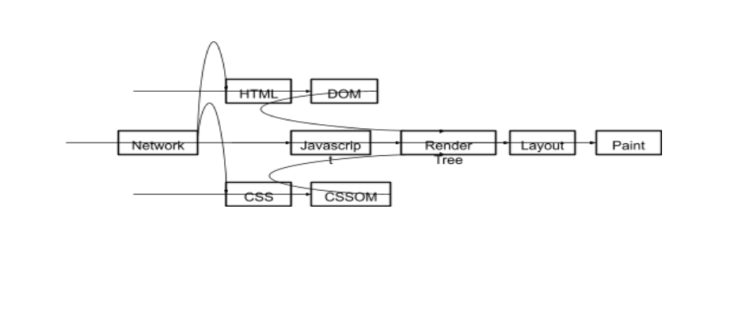

# Working with events

## Stopping Event Propagation

During development, sometimes you need to stop some event listeners from being called under a certain condition. Of course, you can add a condition check to the code of each handler, but a better solution is to add another listener before the others or in an earlier capture phase. In it, we will check the condition and stop further propagation of the event. For this, the event has two methods: Event.stopPropagation() and Event.stopImmediatePropagation().

The first method will stop further propagation of the event up the DOM tree in the current and subsequent phases.

In addition, if several handlers are attached to the same element with the same event type, they are called in the order they were added. If one of these handlers calls event.stopImmediatePropagation(), then the events of the remaining
handlers will not be called.

Let's look at an example:

```html
<form>
  <label
    ><input
      type="radio"
      name="propagation-control"
      value="stopPropagation"
    />Stop propagation</label
  >
  <label
    ><input
      type="radio"
      name="propagation-control"
      value="stopImmediatePropagation"
    />Stop Immediate propagation</label
  >
</form>
<ul>
  <li>First</li>
  <li>Second</li>
  <li>Third</li>
</ul>
<script>
  const form = document.forms[0];
  const list = document.querySelector("ul");
  list.addEventListener(
    "click",
    (e) => {
      console.log("In the first UL in the capture phase");
      const propagationControlMethodName =
        form.elements["propagation-control"].value;
      if (propagationControlMethodName) {
        e[propagationControlMethodName]();
      }
    },
    true
  );
  list.addEventListener(
    "click",
    () => {
      console.log("In the second UL in the capture phase");
    },
    true
  );
  list.addEventListener("click", () => {
    console.log("In the first UL in the bubbling phase");
  });
  Array.from(list.children).forEach((child) => {
    child.addEventListener("click", () => {
      console.log("In each LI in the bubbling phase");
    });
  });
</script>
```

1. Open the file in a browser: Open the index.html file in any modern browser.

2. Select the propagation control method:

   - Select one of the two options in the form: "Stop propagation" or "Stop Immediate propagation".

3. Click on the list items:

   - Click on any list item (for example, "First", "Second" or "Third").

### Expected result

1. If you selected "Stop propagation":
   When you click on a list item, you should see in the console:
   In the first UL in the capture phase
   In the second UL in the capture phase
   In each LI in the bubbling phase
   In the first UL in the bubbling phase
   The event will continue to propagate, and you will see all the messages.
2. If you selected "Stop Immediate propagation":
   When you click on a list item, you should see:
   In the first UL in the capturing phase
   In the second UL in the capturing phase

In this case, event handlers in the bubbling phase will not be executed, since stopImmediatePropagation() will stop further event processing on this item.

> Console: To see the output, open the developer tools in your browser (usually F12 or Ctrl + Shift + I) and switch to the "Console" tab.

> Test: You can click on list items multiple times and switch propagation control methods to see how the behavior changes depending on the selected method.

This way, you can visually see the difference between stopPropagation() and stopImmediatePropagation() in the context of capturing and bubbling events.

## Default Actions and Cancellable Events

Events are typically dispatched by the browser's DOM implementation as a result of user action, in response to task completion, or to signal progress during an asynchronous activity such as a network request.

Some events are used to control what behavior the implementation may take next, or to cancel an action that the implementation has already taken. Events in this category are called cancellable , and the behavior they cancel is called the default action. Cancellable event objects are often associated with one or more default actions. To cancel a default action, you must call the preventDefault() method on the event object.

For example, a mousedown event is dispatched immediately after the user presses a mouse button or other pointing device. One possible default action taken by the implementation is to enter mode. This action allows the user to drag and drop images or select text.

The default action depends on the surrounding conditions. For example, if the user's pointing device is over text, the text will be selected. If the user's pointing device is over an image, the image will be dragged. Disabling the default action for a mousedown event prevents these actions from occurring. Default actions are typically executed after the event has finished dispatching, but in exceptional cases they may also be executed just before the event is dispatched.

```html
<!DOCTYPE html>
<html>
  <head>
    <title>Hello, DOM events!</title>
  </head>
  <body>
    <form name="myForm">
      <label>Test checkbox: <input type="checkbox" /></label>
    </form>
  </body>
</html>
```

The default action associated with the click event for <input type="checkbox"> elements toggles the value of the element's checked attribute. If the default click action for the event is canceled, the value reverts to its previous state.

```JavaScript
const checkbox = document.querySelector('input[type=checkbox]')
        checkbox.addEventListener('click', (event) => {
            console.log(event.target.checked) // true
            event.preventDefault()
        })
```

When an event is canceled, conditional default actions associated with the event are skipped. Or, as mentioned above, if default actions are executed before they are dispatched, their effect is canceled. The cancelability of a default action is specified in the cancelable attribute of the event object. Calling Event.preventDefault() stops all associated default actions of the event object. The Event.defaultPrevented attribute indicates whether the event has already been canceled, for example, via a pre-event listener.

Many implementations additionally interpret the return value from the event listener, for example, false. This means that the default action for cancelable events will be canceled, although window.onerror handlers are canceled by returning true.

```JavaScript
const checkbox = document.querySelector('input[type=checkbox]')
checkbox.addEventListener('click', (event) => {
console.log(event.target.checked) // true
return false
})
```

## Event generation, custom events

In addition to subscribing to built-in events, we can create unique custom and built-in events on a DOM element ourselves. This is useful when implementing UI components or for testing purposes.

The event object is created using the Event base constructor or one of the most suitable constructors from the event class hierarchy.

### Generating built-in events

The following code demonstrates generating a click event on a DOM element.

```html
<button>Click me!</button>
<script>
  const eventOptions = { bubbles: true, cancelable: true };
  const event = new Event("click", eventOptions);
  event.view = window;
  const mouseEvent = new MouseEvent("click", {
    ...eventOptions,
    view: window,
  });
  document.addEventListener("click", (event) => {
    console.log(event.isTrusted);
  });
  const button = document.querySelector("button");
  button.dispatchEvent(event);
  button.dispatchEvent(mouseEvent);
  button.click();
</script>
```

Specialized constructors of the MouseEvent type, unlike Event, support additional fields such as view, clientX, clientY, and others. In the case of the Event constructor, which does not support these fields, additional code will be required to add them to the event object.

Built-in events are also generated by the HTMLElement.click(), HTMLElement.focus(), and other methods.

To make the generated event bubble and cancelable, you must pass the bubbles and cancelable fields in the options.

You can distinguish a generated event from your own by the isTrusted field in the event handler.

> Important! Handlers for generated events are executed synchronously.

Unlike native events, which are fired by the DOM implementation and call event handlers asynchronously through the event loop, dispatchEvent() calls event handlers synchronously. All applicable event handlers will be executed and returned before the code continues after calling dispatchEvent().

To demonstrate how events work in JavaScript with a more understandable and practical example, let's create an interactive page that has a button to add items to a list, as well as a button to remove the last item from the list. We'll use events to handle clicks on these buttons, and demonstrate the difference between user-generated events and programmatically generated events.

#### Example: To-do list

```html
<!DOCTYPE html>
<html lang="en">
  <head>
    <meta charset="UTF-8" />
    <meta name="viewport" content="width=device-width, initial-scale=1.0" />
    <title>Task List Example</title>
    <style>
      body {
        font-family: Arial, sans-serif;
      }
      ul {
        list-style-type: none;
        padding: 0;
      }
      li {
        padding: 5px;
        border: 1px solid #ccc;
        margin: 5px 0;
      }
    </style>
  </head>
  <body>
    <h1>Task List</h1>
    <input type="text" id="taskInput" placeholder="Enter task" />
    <button id="addButton">Add task</button>
    <button id="removeButton">Remove last task</button>

    <ul id="taskList"></ul>

    <script>
      const taskInput = document.getElementById("taskInput");
      const addButton = document.getElementById("addButton");
      const removeButton = document.getElementById("removeButton");
      const taskList = document.getElementById("taskList");

      // Handler for adding a task
      addButton.addEventListener("click", () => {
        const taskText = taskInput.value.trim();
        if (taskText) {
          const li = document.createElement("li");
          li.textContent = taskText;
          taskList.appendChild(li);
          taskInput.value = ""; // Clear the input field
        }
      });

      // Handler for removing the last task
      removeButton.addEventListener("click", () => {
        const lastTask = taskList.lastElementChild;
        if (lastTask) {
          lastTask.remove();
        }
      });

      // Add a click event handler to the entire list
      taskList.addEventListener("click", (event) => {
        if (event.target.tagName === "LI") {
          console.log("Task selected:", event.target.textContent);
          console.log("isTrusted:", event.isTrusted);
        }
      });

      // Programmatically adding a task
      const programmaticAddTask = (taskText) => {
        const eventOptions = { bubbles: true, cancelable: true };
        const event = new Event("click", eventOptions);
        const li = document.createElement("li");
        li.textContent = taskText;
        taskList.appendChild(li);
        li.dispatchEvent(event);
      };

      // Add task programmatically after 3 seconds
      setTimeout(() => {
        programmaticAddTask("Programmatic task");
      }, 3000);
    </script>
  </body>
</html>
```

#### Code Explanation

**HTML:**

- We have a text field for entering a task and two buttons: one for adding a task to the list and one for deleting the last task.
- The list of tasks (ul) will be dynamically populated with li elements.

**JavaScript:**

- We get references to the elements: the input field, the buttons, and the list of tasks.
- Adding a task: When the "Add task" button is clicked, a new li element is created with the text from the input field and added to the list. The input field is cleared.
- Deleting a task: When the "Delete last task" button is clicked, the last item in the list is deleted.
- List click handler: When the user clicks on a list item, the task text and the isTrusted value are printed to the console. This allows you to see if the event is "trusted" (i.e. initiated by the user).
- Programmatically adding a task: The programmaticAddTask function creates a new list item and programmatically triggers a click event. 3 seconds after the page loads, the "Programmatic task" task is added.

### Generating Custom Events

Like built-in events, custom events are generated using the base Event class or the more specialized CustomEvent class. The only difference between them is the support of an additional detail field:

```JavaScript
<!DOCTYPE html>
<html lang="en">
<head>
<meta charset="UTF-8">
<meta name="viewport" content="width=device-width, initial-scale=1.0">
<title>Custom Event Example</title>
<style>
body {
font-family: Arial, sans-serif;
}
ul {
list-style-type: none;
padding: 0;
}
li {
padding: 5px;
border: 1px solid #ccc;
margin: 5px 0;
cursor: pointer;
}
.completed {
text-decoration: line-through;
color: gray;
}
</style>
</head>
<body>

<h1>Task List</h1>
<input type="text" id="taskInput" placeholder="Enter task">
<button id="addButton">Add task</button>

<ul id="taskList"></ul>

<script>
const taskInput = document.getElementById('taskInput');
const addButton = document.getElementById('addButton');
const taskList = document.getElementById('taskList');

// Function for creating a custom event
function createTaskEvent(task) {
const event = new CustomEvent('taskCompleted', {
detail: { task },
bubbles: true,
cancelable: true
});
return event;
}

// Handler for adding a task
addButton.addEventListener('click', () => {
const taskText = taskInput.value.trim();
if (taskText) {
const li = document.createElement('li');
li.textContent = taskText;
li.addEventListener('click', () => {
li.classList.toggle('completed');
const event = createTaskEvent(taskText);
li.dispatchEvent(event);
});
taskList.appendChild(li);
taskInput.value = ''; // Clear the input field
}
});

// Custom event handler
taskList.addEventListener('taskCompleted', (event) => {
console.log(`Task "${event.detail.task}" was marked as completed.`);
});
</script>

</body>
</html>
```

#### Code Explanation

**HTML:**

We have a text field for entering a task and a button for adding a task to the list. The list of tasks (ul) will be dynamically populated with li elements.

**JavaScript:**

We get references to the elements: the input field, the add button and the list of tasks.

- Creating a custom event:

```JavaScript
function createTaskEvent(task) { const event = new CustomEvent('taskCompleted',
{ detail: { task }, bubbles: true, cancelable: true }); return event; }
```

The createTaskEvent function creates a custom taskCompleted event that contains task information in the detail property. This event can bubble and be canceled.

- Adding a task:

When the "Add task" button is clicked, a new li element is created with the task text.

A click handler is added to each list item, which toggles the completed class (to mark the task as completed) and triggers the taskCompleted custom event.

- Custom event handler:

```JavaScript
taskList.addEventListener('taskCompleted', (event) => {
console.log(`Task "${event.detail.task}" was marked as completed.`);
});
```

This handler is triggered when the taskCompleted custom event occurs and prints a message to the console with the text of the completed task.

### Canceling the default action in custom events

Like built-in events, custom events support canceling the default action using the event constructor's cancelable options and calling Event.preventDefault(). The code that creates the event decides what to do if one of the handlers calls Event.preventDefault(). It does this by using the result of calling the dispatchEvent() method.

```Html
<pre id="rabbit">
|\ /|
\|_|/
/. .\
=\_Y_/=
{>o<}
</pre>
    <button>Hide the rabbit</button>
    <script>
        const rabbit = document.querySelector('#rabbit');
        const button = document.querySelector('button');

        rabbit.addEventListener('hide', (event) => {
            if (confirm('Call event.preventDefault()?')) {
                event.preventDefault();
            }
        });

        button.addEventListener('click', () => {
            const event = new CustomEvent('hide', { cancelable: true });
            const defaultPrevented = !rabbit.dispatchEvent(event);
            if (defaultPrevented) {
                console.log('Cancelled by event handler');
            } else {
                rabbit.hidden = true;
            }
        });
    </script>
```

## How the Browser Uses the DOM

Up until this section, we've only looked at working with the DOM from the perspective of a user of the DOM API for JavaScript. To gain a deeper understanding of the Document Object Model (DOM) and its
role, let's look at the steps the browser goes through when displaying a web page, from receiving a response from the server or from a local file on your computer to drawing the pixels on your screen. This sequence of steps is called the Critical Rendering Path.



It is divided into two large stages:

1. Code analysis and rendering tree construction:
   - Receiving an HTML document over the network or reading from a local disk.
   - Processing HTML code and creating DOM, sending additional requests.
   - Processing CSS styles and creating CSSOM.
   - Executing synchronous JavaScript code.
2. Direct page rendering:
   - Creating a page layout (Layout).
   - Rasterization or rendering the page on the screen (Painting).

### Building a Render Tree

A render tree, or render model, is a special structure consisting of
elements that will be displayed on the page and their associated styles. Such a tree is assembled from two independent data structures (models):

1. DOM — an object model of all page elements. Assembled based on
   the page's HTML markup.
2. CSSOM — an object model of the page's style sheet. Assembled based on
   the page's CSS markup.

> Important! The render model, consisting of DOM and CSSOM, contains only visible elements and does not include hidden ones. For example, those whose styles specify display: none.

### Building a DOM model

Building a DOM model is divided into the following stages:

1. Conversion. The browser converts bytes from an HTML file located on disk or the network into characters based on the encoding specified in the file (for example, UTF-8).
2. Markup. Based on the W3C HTML5 standard, the browser distinguishes tags in angle brackets, such as <html> and <body>, among characters. Each tag has its own meaning and set of rules.
3. Creating objects. Using HTML tags, the browser distinguishes objects with specific properties in the document.
4. Forming the DOM. Objects form a tree structure that repeats the hierarchy of the HTML file, in which some tags are placed inside others. Thus, the p object is placed under body, and the body object, in turn, is placed under html, and so on.

The result is a document object model (DOM), which the browser uses to continue processing the page.

So, the DOM is ready. But to display the page on the screen, the object structure alone is not enough.

The browser also determines how these objects look.

Let's look at the next step - the formation of an object model related to the style sheet (CSSOM).

### Building a CSSOM model

The CSS object model (CSSOM), like the DOM, is represented as a tree of objects with associated styles for each node, regardless of whether they are explicitly declared or implicitly inherited.

With the similarities in the processing of HTML and CSS code, it is worth mentioning that CSS is a blocking rendering resource. This means that the rendering model cannot be built until all styles on the page have been fully processed due to the peculiarities of their (styles) cascading implementation.

Styles specified later in the document override those defined before them. CSS also blocks the execution of JavaScript code, which is waiting for the CSSOM to be formed.

### JavaScript execution

JavaScript code placed on the page blocks the processing of the HTML document itself. When a browser encounters a script tag, whether it is considered external, pointing to an external file in the src attribute, or internal, including JavaScript code, it stops to download (if external) and execute. Therefore, if a page contains JavaScript code that references elements in the DOM, it is advisable to place it near the end of the document.

To avoid blocking the browser from processing the document, external JavaScript tags are marked as asynchronous by adding the async attribute: <script async src="script.js">.

We learned how the DOM and CSSOM are built from HTML and CSS files. These independent models are responsible for different aspects of the page: the DOM describes the content, and the CSSOM describes the styles that are applied to it. Let's look at how the browser combines these models and displays the page on the screen.

To build a rendering model, the browser does the following:

1. Starting from the base of the DOM, find all visible objects.
   a. This step does not touch elements that will not be visible on the page, such as script tags, meta tags, etc.
   b. It does not touch objects marked as invisible using CSS.
2. Finds style sets in the CSSOM and assigns them to the appropriate objects.
3. Builds a model from visible objects, their content, and styles.

With the rendering model built, the browser is one step closer to displaying the page on the screen!

Now you can start building the layout.

### Creating a Layout

The layout is what defines the size of the viewport and provides context for CSS styles that depend on it, such as percentages or viewport units. The size of the viewport is determined by the viewport meta tag specified in the document's head, or, if no tag is specified, the viewport width is used, which defaults to 980 pixels.

The most common value for the viewport meta tag is the viewport size, set to the device width:

```html
<meta name="viewport" content="width=device-width, initial-scale=1.0" />
```

If a user visits a web page on a device with a width of 1000 pixels, the dimensions will be based on this unit. Half of the viewport will be 500 pixels, 10vw will be 100 pixels, and so on.

So, the browser has already determined:

- what objects will be visible on the page;
- what styles should be assigned to them.

It's time to create a layout, that is, to figure out:

- what size the objects will be;
- how they should be positioned in the viewport.

To do this, the browser will calculate the geometric shape of the objects by analyzing the visualization model from the very beginning. Let's look at a simple example:

```html
<!DOCTYPE html>
<html>
  <head>
    <meta name="viewport" content="width=device-width,initial-scale=1" />
    <title>Hello, world!</title>
  </head>
  <body>
    <div style="width: 50%">
      <div style="width: 50%">Hello, world!</div>
    </div>
  </body>
</html>
```

There are two div blocks in the body of this page. The width of the parent block is 50% of the viewport, and the nested block is 50% of the parent, or 25% of the screen.

After creating the layout, the browser receives a box model that accurately reflects the location and size of each object in the viewport. All relative values ​​are converted to absolute pixel positions on the screen.

Finally, when the browser knows which objects will be displayed on the page, where to place them, and what styles to assign to them, it can proceed to the next stage - displaying the page on the screen. This stage is also called rendering or rasterization.

### Rasterization (Painting)

Finally, the rasterization step converts the visible content of the page into pixels for display on the screen.
How long the painting step takes depends on the size of the DOM, as well as the styles applied. Some styles are more difficult to implement than others. For example, drawing a complex gradient background image takes longer than simply filling the background with a single color.

## Practice

### Task one

1. In html create a checkbox element and text next to it “I agree with the terms”

```html
<!DOCTYPE html>
<html lang="en">
  <head>
    <meta charset="UTF-8" />
    <meta name="viewport" content="width=device-width, initial-scale=1.0" />
    <title>Checkbox</title>
  </head>
  <body>
    <form class="form">
      <label for="checkbox">
        <input type="checkbox" class="checkbox" />
        I agree with the terms
      </label>
    </form>
  </body>
</html>
```

2. Add a send button

```html
<button type="submit" class="button">Send</button>
<p class="status"></p>
<!-- Element for displaying status -->
```

3. When clicking on the send button, you need to check whether the checkbox element is selected as active
4. If the element is not selected, add text under the checkbox “You must agree with the terms”

```JavaScript
const formEl = document.querySelector(".form"); // Use querySelector
const checkboxEl = formEl.querySelector(".checkbox"); // Get the checkbox element
const sendBtn = document.getElementById("send"); // Get the button by ID
const statusText = document.querySelector(".status"); // Use querySelector

sendBtn.addEventListener("click", (event) => {
event.preventDefault(); // Prevent form submission

const isChecked = checkboxEl.checked; // Check checkbox status
const message = isChecked ? 'Data sent successfully' : 'You must agree to the terms and conditions';
statusText.textContent = message; // Display message

if (isChecked) {
console.log('Form data would be sent to the server here.');
}
});
```

### Task two

1. In html create 2 radio button elements (input type=”radio”) and text “Tea”, “Coffee” respectively

```html
<!DOCTYPE html>
<html lang="en">
  <head>
    <meta charset="UTF-8" />
    <meta name="viewport" content="width=device-width, initial-scale=1.0" />
    <title>Radio Button Example</title>
  </head>
  <body>
    <h1>Choose your favorite beverage:</h1>

    <label> <input type="radio" name="beverage" value="tea" /> Tea </label
    ><br />

    <label> <input type="radio" name="beverage" value="coffee" /> Coffee </label
    ><br />
  </body>
</html>
```

2. Send button

```html
<button id="send">Send</button>
<p id="status"></p>
<!-- Element to display the selected beverage -->
```

3. If tea is selected, it is necessary to display the message “The tea is over”
4. If coffee is selected, it is necessary to display the message “The coffee is gone”

```html
<p id="message"></p>
<!-- Element to display the message about availability -->
<script>
  const sendButton = document.getElementById("send");
  const statusText = document.getElementById("status");
  const messageText = document.getElementById("message");

  sendButton.addEventListener("click", () => {
    // Get the selected radio button
    const selectedBeverage = document.querySelector(
      'input[name="beverage"]:checked'
    );

    if (selectedBeverage) {
      // Display the selected beverage
      statusText.textContent = `You selected: ${selectedBeverage.value}`;

      // Check which beverage was selected and display the corresponding message
      if (selectedBeverage.value === "tea") {
        messageText.textContent = "The tea is over";
      } else if (selectedBeverage.value === "coffee") {
        messageText.textContent = "The coffee is gone";
      }
    } else {
      // No beverage selected
      statusText.textContent = "Please select a beverage.";
      messageText.textContent = ""; // Clear the message
    }
  });
</script>
```

### Task three

1. Create an input field (password)
2. Submit button

```html
<h1>Create an Account</h1>

<form class="registrationForm">
  <label for="password">Password:</label>
  <input type="password" class="password" name="password" required />
  <br /><br />
  <button type="submit" class="button">Submit</button>
</form>
```

3. If the user enters the text “password”, the input field should be highlighted in green
4. If the password is incorrect, the input field will have a red outline and the text “incorrect password”

```html
<style>
  .correct {
    border: 2px solid green;
  }
  .incorrect {
    border: 2px solid red;
  }
</style>
<script>
  const form = document.getElementById("registrationForm");
  const passwordInput = document.querySelector(".password");
  const statusText = document.getElementById("status");

  // Set the default password
  const defaultPassword = "password"; // Set the default password here

  form.addEventListener("submit", (event) => {
    event.preventDefault(); // Prevent the form from submitting

    const enteredPassword = passwordInput.value;

    // Reset styles before new validation
    passwordInput.classList.remove("correct", "incorrect");
    statusText.textContent = ""; // Clear previous message

    if (enteredPassword === defaultPassword) {
      passwordInput.classList.add("correct"); // Add a class for the correct password
      statusText.textContent = "Password is correct!"; // Display the message
    } else {
      passwordInput.classList.add("incorrect"); // Add a class for the incorrect password
      statusText.textContent = "Incorrect password"; // Display the error message
    }
  });
</script>
```

### Homework

Given the [HTML](./homework.html) markup.

#### Task

Tasks:

1. When the value in the <input> with id="from" changes, the value contained in it should be immediately displayed in the <span>.
   - This means that every time the text in the input changes, the text in the <span> should be updated accordingly.
2. When clicking on the button with the class messageBtn, you must perform the following actions for the element with the class message:
   - Add two classes: animate_animated and animate_fadeInLeftBig.
   - Set the visibility style to 'visible'.
3. When submitting the form, check if all the fields are filled in.
   - If any field is not filled in, the form should not be submitted.
   - Unfilled fields should be highlighted (the error class is added).
   - As soon as the user starts filling in the field, perform a check:
     - If the field is empty, highlight it (add the error class).
     - If the field is filled, remove the highlight (remove the error class).
