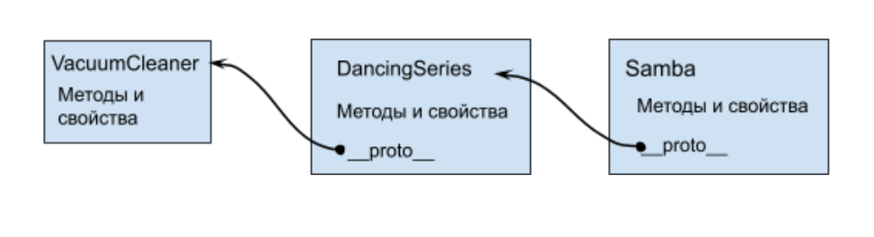
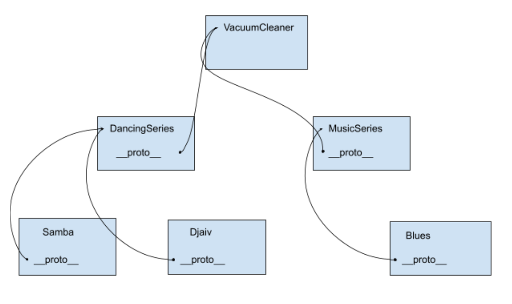

# Object-oriented programming and inheritance

## Prototype

Before ES2015, JavaScript did not have the concept of a class like other programming languages, so the ability to work with objects like in object-oriented languages ​​was implemented through the use of prototypes - a specialized property in an object that is added to any new object.

So the inheritance of properties from parent to child occurs through this special property **proto**, which indicates which object to refer to as a parent.

Let's look at examples of what a prototype is, why it is needed and how it works.

For examples, we will take examples from our previous lesson about robotic vacuum cleaners. To begin, we will create a simple robotic vacuum cleaner object without characteristics and with generalized methods.

This will be some kind of abstract robotic vacuum cleaner in a vacuum:

```javascript
// Robot vacuum cleaner object.
const VacuumCleaner = {
  Model: "vacuum cleaner",
  counterOfStarts: 0,
  isFull: false,
  isObstacle: false,
  startCleaning: function () {
    this.counterOfStarts++;
    // Add some extra output to know whose method we
    called.console.log("I am the method of VacuumCleaner");
    console.log(
      "I am cleaning... I have been started: ",
      this.counterOfStarts,
      "times."
    );
  },
  goCharge: function () {
    // Add some extra output to know whose method we
    called.console.log("I am the method of VacuumCleaner");
    console.log("I am going to charge...");
  },
};
```

We left only service properties and methods in it, and we even removed the isUVLampOn properties - since this property will not be in all vacuum cleaner models.

Now we would like to create a vacuum cleaner with specific characteristics, but in order not to create an object from scratch and write all the properties, we can take the basic VacuumCleaner model and inherit from it, setting the prototype properties of the new object **proto** to the parent object and adding new properties - like this:

```javascript
const DancingSeries = {
  // Declare new properties and override the model property.
  model: "dancing series",
  power: 200,
  batterySize: 2100,
  boxSize: 0.5,
  workTime: 45,
  isUVLampOn: false,
  // Add a new method.
  switchUVLamp: function () {
    // Add an extra line to know whose method we called.
    console.log("I am the method of DancingSeries");
    this.isUVLampOn = !this.isUVLampOn;
    console.log(`UV lamp is ${this.isUVLampOn ? "working" : "not working"}.`);
  },
  // Make a reference to the prototype from the parent.
  __proto__: VacuumCleaner,
};
```

Our new object DancingSeries is also a kind of general object for creating a series of vacuum cleaners with the same functionality and different characteristics.

Next, based on it, we can create several specific models of vacuum cleaners by rewriting the characteristics in them. Let's create a Samba robot:

```javascript
const Samba = {
  // Update properties for a specific model.
  model: "Samba-1",
  power: 250,
  batterySize: 2500,
  workTime: 50,
  // Make a reference to the prototype from the parent.
  __proto__: DancingSeries,
};
```

As we can see, the code of a particular object has become very small, and we have a chain of objects linked through prototypes thanks to the **proto** property.



Our first parent object also has a **proto** property, it refers to the Object object, since we did not specify it. Let's try calling the methods and properties of our new Samba object:

```javascript
// Accessing object properties.
console.log(Samba.model); // "Samba-1"
console.log(Samba.isFull); // false
// Call object methods.
Samba.startCleaning();
// I am the method of VacuumCleaner
// 'I am cleaning... I have been started: 1 times.'
Samba.isUVLampOn = true;
Samba.switchUVLamp();
// I am the method of DancingSeries
// 'UV lamp is not working.'
Samba.goCharge();
// I am the method of VacuumCleaner
// 'I am going to charge...'
```

All properties and methods are available when accessing the Samba object, and as we can see, when they are not in the object itself, the JavaScript engine tries to find them in the parent object, which is specified in the **proto** property, and will search up the prototype chain until it finds one, or will get undefined if the property or method is not found even in the topmost Object.

It is the prototype mechanism that allows us to use the methods of the Array object, when we create our custom arrays, for them the **proto** property is automatically set to the Array object, and the **proto** of the Array object refers to the Object object.

If we try to override a property or method from the parent object in the descendant, the parent object remains untouched, and the new property or method will be written to the child, and it will be called when accessing it, let's create another robot and override the startCleaning method in it:

```javascript
// Robot vacuum cleaner object.
const Djaiv = {
// Update properties for a specific model.
model: "Djaiv-1",
power: 250,
batterySize: 2500,
workTime: 50,
// Override startCleaning method.
startCleaning: function () {
this.counterOfStarts++;
// Add additional output to know whose method
we called.
console.log('I am the method of Djaiv');
console.log('I am Djaiv, and I am cleaning... I have
been started: ', this.counterOfStarts, 'times.');
},
// Make a reference to the prototype from the parent.
__proto__: DancingSeries,
};
```

And let's try to call the Samba and Djaiv vacuum cleaner methods to see the difference:

```javascript
// Call object methods.
Samba.startCleaning();
// I am the method of VacuumCleaner
// 'I am cleaning... I have been started: 1 times.'
Djaiv.startCleaning();
// I am the method of Djaiv
// I am Djaiv, and I am cleaning... I have been started: 1 times.
```

We can see that the Samba object uses the parent method and it has not changed, and Djaiv uses its own method.

## Methods for setting the prototype

You can set the prototype of an object using the **proto** property, but the language also has two methods for reading and setting the prototype of an object - these are getPrototypeOf and setPrototypeOf. These methods are not available in Internet Explorer versions below 10.

### getPrototypeOf

The getPrototypeOf method allows you to get a reference to the prototype object. Let's find out which object is the prototype for our Djaiv object, then see who is its prototype and who is the prototype of its prototype:

```javascript
// Get a prototype for the Djaiv object.
const DjaivProto = Object.getPrototypeOf(Djaiv);
console.log(DjaivProto.model); // dancing series
const DjaivProtoProto = Object.getPrototypeOf(DjaivProto);
console.log(DjaivProtoProto.model); //vacuum cleaner
const DjaivProtoProtoProto = Object.getPrototypeOf(DjaivProtoProto);
console.log(DjaivProtoProtoProto); // [object Object]
```

In the last prototype we did not look at the model property, because it is not there, we got to the highest parent, which is the Object object, all objects are inherited from it. If we try to get its prototype, then in response we will get null, because the Object object does not have a prototype.

### setPrototypeOf

Why might you need to know the prototype of an object?

Let's create another series of robots - musicSeries, with slightly different functionality (they will be able to wash floors), and set it as a prototype for our new Blues vacuum cleaner.

Since the new series will have additional functionality that is not present in the DancingSeries, before calling such functionality on a certain object, it is worth checking who its parent is.

To set the prototype, we use the setPrototypeOf method - it takes two arguments, the first is the object for which the prototype is set, the second is the object that will be the prototype for the first.

First, let's create a series object:

```javascript
// Robot vacuum cleaner object.
const MusicSeries = {
// Declare new properties and override the model property.
model: "music series",
power: 200,
batterySize: 2100,
boxSize: 0.5,
workTime: 45,
// Add a new method.
startWipe: function () {
// Add an additional output to know whose method
we called.
console.log('I am the method of MusicSeries');
console.log('I am starting to wipe the floor...');
},
// Make a reference to the prototype from the parent.
__proto__: VacuumCleaner,
};
// Robot vacuum cleaner object.
const MusicSeries = {
// Declare new properties and override the model property.
model: "music series",
power: 200,
batterySize: 2100,
boxSize: 0.5,
workTime: 45,
// Add a new method.
startWipe: function () {
// Add an extra output to know whose method
we called.
console.log('I am the method of MusicSeries');
console.log('I am starting to wipe the floor...');
},
// Make a reference to the prototype from the parent.
__proto__: VacuumCleaner,
};
```

Let's create our new robot:

```javascript
// Robot vacuum cleaner object.
const Blues = {
  // Update properties for a specific model.
  model: "Bluees-1",
  power: 250,
  batterySize: 2500,
  workTime: 50,
};
// Set a prototype for the robot.
Object.setPrototypeOf(Blues, MusicSeries);
```

Now we can try to call the methods of our robots, checking who is their prototype:

```javascript
if (Object.getPrototypeOf(Djaiv).model === "dancing series") {
  Djaiv.startCleaning(); //
}
if (Object.getPrototypeOf(Blues).model === "music series") {
  Blues.startWipe(); //
}
// If we don't check the prototype and just call a method of someone else's prototype, we will naturally get an error.
Djaiv.startWipe(); // Uncaught TypeError: Djaiv.startWipe is not a function
```

Let's look at the structure of the base models we've created and all the robots we've created so far to better see the inheritance:



## Object constructor

Up to this point, we have been creating objects and setting up a prototype for one specific object.

But what if we want to create five objects of the same type at once, for example, five Samba vacuum cleaners, do we have to write the same type of code for each object?

Fortunately, like many other programming languages, JavaScript provides the ability to create an object constructor - a function that allows you to create instances of objects, while allowing you to initialize the object. The object constructor is not called directly, but using the new operator, which allows you to create a new instance of the object.

To create a constructor function for an object, it must be named with a capital letter (not required, but this allows you to clearly see that this is a constructor for an object), and inside this function, declare properties and methods for the
object using this.

We can also pass arguments to this function, which we can use as initial values ​​for properties, or to create complex logic in methods, or even determine which methods and properties the object will receive depending on the arguments.

Let's create a constructor function for Samba robots:

```javascript
// Constructor of the robot vacuum cleaner object.
function Samba(serailNumber) {
  // Create the object properties using this.
  this.serialNumber = serailNumber;
  this.model = "Samba-1";
  this.power = 250;
  this.batterySize = 2500;
  this.workTime = 50;
  // Make a reference to the prototype from the parent.
  this.__proto__ = DancingSeries;
}
// Create an instance of the new object.
const Samba1 = new Samba(1014778);
console.log(Samba1.serialNumber); // 1014778
console.log(Samba1.startCleaning()); // I am the method of VacuumCleaner
// I am cleaning... I have been started: 1 times.
```

Instead of creating a specific object, we created a function that does the same thing, only writes properties and methods through this.

And to create the object itself, we need to call this function through the new operator.

Why exactly through it and what it does we will discuss below, but for now let's create several instances of the Samba robot to see all the beauty of constructors:

```javascript
// Let's create 10 Samba robot vacuum cleaners, like on a conveyor belt.
const robots = [];
for (let index = 0; index < 10; index++) {
// Let's create an instance of a new object and add it to
our robots array, each with a unique serial number.
robots.push(new Samba(index));
}
console.log(robots[3].serialNumber); // 3
console.log(robots[7].serialNumber); // 7
```

Next, we can interact with our array of robots as we like, process it in cycles, access each robot separately, and we only needed four lines of code to create this number of robots.

Let's touch on the point about setting the prototype for objects created by the constructor.

We can specify this.**proto** to set the prototype, or we can specify our prototype in the prototype property of the constructor itself like this:

```javascript
// Robot vacuum cleaner object constructor.
function Samba(serailNumber) {
  // Create object properties using this.
  this.serialNumber = serailNumber;
  this.model = "Samba-1";
  this.power = 250;
  this.batterySize = 2500;
  this.workTime = 50;
}
// Make a reference to the prototype from the parent.
Samba.prototype = DancingSeries;
// Create an instance of a new object.
const Samba1 = new Samba(1014778);
console.log(Samba1.serialNumber); // 1014778
console.log(Samba1.startCleaning()); // I am the method of
VacuumCleaner;
// I am cleaning... I have been started: 1 times.
```

Let's now figure out why our function, which does not return anything in the code after calling via the new operator, returns us a new object with all the properties we need. And it is not the function itself that does this, but the new operator.

## The new operator

The new operator allows you to create new objects using a constructor function. It works like this:

1. Creates an empty object that will be filled with everything it needs.
2. Sets this object as this for the constructor function, so that you can use this inside the function and add properties and methods to this object.
3. Calls the constructor function to initialize the object.
4. If the constructor function has a prototype property, sets the value of this property as the prototype for the new object (the **proto** property).
5. Sets the constructor property of the object with a reference to the constructor function.
6. If the constructor function does not return anything or returns some primitive value, then the new operator will return a newly created and filled object, if the constructor returns an object, then the new operator will return this object.

Not so difficult, let's try to create our own version of the new operator in the form of a
function:

```javascript
// Our implementation of the new operator via the createObject function.
function createObject(constructor) {
// Create a new object.
const obj = {};
// Set the prototype of the new object to the prototype of the
constructor function Object.setPrototypeOf(obj, constructor.prototype);
// Call the constructor function, passing it the object created in step 1 as this, and passing the remaining arguments,
if they were passed to createObject
const argsArray = Array.prototype.slice.apply(arguments);
const result = constructor.apply(obj, argsArray.slice(1));
// Return the new object if the constructor returned a primitive
value or undefined, otherwise return what the constructor returned.
if (!result || typeof result === 'string' || typeof result
=== 'number' || typeof result === 'boolean') {
return obj
} else {
return result;
}
}
// Create an instance of a new object.
const Samba1 = createObject(Samba, 1014778);
// Check the property settings in the constructor.
console.log(Samba1.serialNumber); // 1014778
// Check that the prototype was set correctly, and we can
call methods from parent objects.
console.log(Samba1.__proto__); // {model: "dancing series", power: 200, batterySize: 2100, boxSize: 0.5, workTime: 45, ...}
console.log(Samba1.startCleaning()); // I am the method of VacuumCleaner
// I am cleaning... I have been started: 1 times.
// Check the constructor assignment.
console.log(Samba1.constructor); // function Object() { [native code] }
```

> ❗The **proto** property of an object and the prototype property of a constructor function are not the same thing. The **proto** property is present on an object instance, and it allows you to find the object's parents, the prototype property performs a utility function when creating an object instance via the new operator. Look at the code example that will dot the "i's".

```javascript
// Constructor of the robot vacuum cleaner object.
function Samba(serailNumber) {
  // Create the object properties using this.
  this.serialNumber = serailNumber;
  this.model = "Samba-1";
  this.power = 250;
  this.batterySize = 2500;
  this.workTime = 50;
}
// Make a reference to the prototype from the parent.
Samba.prototype = DancingSeries;
// Create an instance of a new object.
const Samba1 = new Samba(1014778);
// Look at the __proto__ and prototype properties
console.log(Samba1.__proto__); // {model: "dancing series", power: 200, batterySize: 2100, boxSize: 0.5, workTime: 45, ...}
console.log(Samba1.prototype); // undefined
console.log(Samba1.__proto__ === Samba.prototype); // true
```

## Object.create

The Object.create method allows you to create new objects by accepting as arguments a prototype object for the object being created, and the second argument (optional) properties for the new object in the format of an object with keys and descriptor values ​​for the properties.

It is not very convenient to use this method to create new objects like our robot vacuum cleaners, you will either need to specify all the properties of the new object with descriptors, which is not very convenient (but flexible), or create an object using the method with a prototype, and add all the other properties later, but there is an important feature of this method, which can be used - you can pass null as the first argument, and then an object without a prototype will be created.

Let's look at an example of why we need this:

```javascript
// Let's create a Samba robot vacuum cleaner.
const Samba1 = new Samba(101);
// Let's try to access the standard toString method, even though we haven't declared it in any of the objects.
console.log(Samba1.toString()); // [object Object]
```

Although we did not declare the toString method in our chain of objects, it is present and comes from the very first object (the base one), because its prototype is the Object itself, and the toString method came from it. Sometimes it happens that we do not need other people's methods at all, and do not need a prototype in the object, because the access to the properties of the object is determined by what the user writes, and the user can request the toString property, which we would not like to show, and this is where you can use the Object.create method:

```javascript
// Create an empty object without a prototype.
const Samba1 = Object.create(null);
// Let's try to access the standard toString method and
look at the __proto__ property
console.log(Samba1.toString); // undefined
console.log(Samba1.__proto__); // undefined
```

## Creating Objects and Inheritance Using class and extends

We learned how to create objects and set prototypes, create constructors, and figured out how the new operator works. With the advent of ES2015, class syntax was added to the language so that all these operations could be done more conveniently and in a more familiar syntax for those who have already programmed using classes in other programming languages.

Let's create our robots using the new syntax.

```javascript
// Robot vacuum cleaner class.
class VacuumCleaner {
  model = "vacuum cleaner";
  counterOfStarts = 0;
  isFull = false;
  isObstacle = false;
  // To create a constructor, you need to create a method constructor.
  constructor() {}
  startCleaning() {
    this.counterOfStarts++;
    // Let's add an additional output to know whose method we called.
    console.log("I am the method of VacuumCleaner");
    console.log(
      "I am cleaning... I have been started: ",
      this.counterOfStarts,
      "times."
    );
  }
  goCharge() {
    // Let's add an additional output to know whose method we called.
    console.log("I am the method of VacuumCleaner");
    console.log("I am going to charge...");
  }
}
// Let's try to create an instance of the class and see how it works.
const BaseRobot = new VacuumCleaner();
console.log(BaseRobot.constructor); // class VacuumCleaner {
// model = "vacuum cleaner";
// counterOfStarts = 0;
// isFull = false;
// isObstacle = false;
// To create a constructor, you need to create a constructor method.
// constructor() {
// }
// ...
console.log(BaseRobot.model); // vacuum cleaner
console.log(BaseRobot.startCleaning()); // I am the method of VacuumCleaner
// I am cleaning... I have been started: 1 times.
```

We have created our base class, and we can see that it has methods and properties, and the constructor method prints out the class itself. The class also sets up a prototype for the object, to do this we need to extend our base class using the extend keyword. Let's create our DancingSeries extension class:

```javascript
// Extended DancingSeries class. Using extends we specify which class we will inherit from.
class DancingSeries extends VacuumCleaner {
// Declare new properties and override the model property.
model = "dancing series";
power = 200;
batterySize = 2100;
boxSize = 0.5;
workTime = 45,
isUVLampOn = false;
// Add a new method.
switchUVLamp() {
// Add additional output to know whose method we called.
console.log('I am the method of DancingSeries');
this.isUVLampOn = !this.isUVLampOn;
console.log(`UV lamp is ${this.isUVLampOn ? 'working' : 'not working'}.`);
}
};
// Let's create a new instance of the class to see how it works and what it contains.
const DancingRobot = new DancingSeries;
console.log(DancingRobot.__proto__); // VacuumCleaner {constructor: ƒ, switchUVLamp: ƒ}
console.log(DancingRobot.model); // dancing series
console.log(DancingRobot.switchUVLamp()); // I am the method of DancingSeries
// lamp is working.
```

We have extended our base class, and when we create an instance of a new robot, we see in it a
prototype for the base class, a new method, and a predefined model property.

Everything works as expected and as expected.

Now let's look at what classes do. The work of classes is quite simple and transparent. When declaring a class, the JavaScript engine creates a constructor function by the class name and takes its code from the class constructor method; if there is no such method, the function will be empty. If the class extends another class, then the prototype property is specified for this function. After that, it finds all the other methods of the object and writes them in the prototype property for the new function.

That is why in the prototype for the DancingSeries object we saw not only the methods of the parent
class, but also the method of the DancingSeries class. Well, then everything is simple, we got a constructor function, with a prototype and all the necessary methods, so when calling the new operator, we create our object as if it were created in the old way.

Of course, there are subtleties in how classes work, for example, the constructor function created by the class cannot be called without using the new operator, and all methods created by it will be marked as non-enumerable. Let's take the previous example and look at the constructor function created by the class:

```javascript
// The generated constructor is a function whose code is taken from the constructor.
console.log(DancingSeries === DancingSeries.prototype.constructor); // true
// The generated constructor has a prototype property and it contains all the methods.
console.log(DancingSeries.prototype); // VacuumCleaner {constructor: ƒ, switchUVLamp: ƒ}
```
