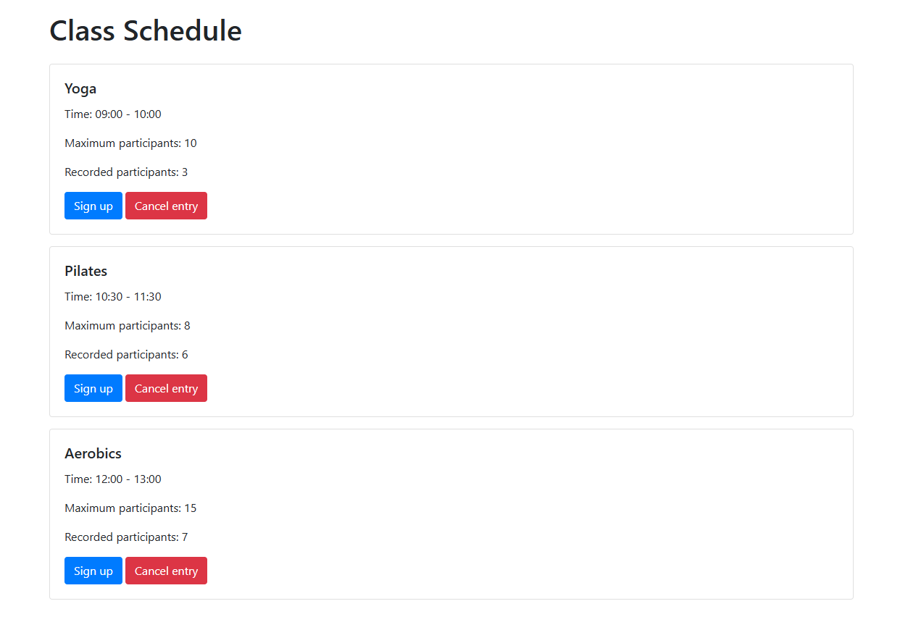

You are designing a web page to display the schedule of classes at a sports club. Each class has a title, time, maximum number of participants, and the current number of enrolled participants.

1. Create a web page with a title of "Class Schedule" and an area to display the classes.

2. Load the class information from the provided JSON data. Each class should be displayed on the page with its title, time, maximum number of participants, and the current number of enrolled participants.

3. The user can click the "Sign Up" button to sign up for the class. If the maximum number of participants has already been reached, the "Sign Up" button becomes inactive.

4. After the user has successfully signed up for the class, update the number of enrolled participants and the state of the "Sign Up" button.

5. The user can cancel the class by clicking the "Cancel Enrollment" button. After the cancellation, update the number of enrolled participants and the state of the button.

6. All changes (record, cancel) should be saved and displayed in real time on the page.

7. When developing, use Bootstrap to style elements.

## Solution

1. Create a web page with a title of "Class Schedule" and an area to display the classes.

```html
<!DOCTYPE html>
<html lang="en">
  <head>
    <meta charset="UTF-8" />
    <meta name="viewport" content="width=device-width, initial-scale=1.0" />
    <title>Class Schedule</title>
    <link
      rel="stylesheet"
      href="https://stackpath.bootstrapcdn.com/bootstrap/4.5.2/css/bootstrap.min.css"
    />
  </head>
  <body>
    <div class="container">
      <h1 class="mt-4">Class Schedule</h1>
      <div id="schedule" class="mt-4"></div>
    </div>

    <script src="script.js"></script>
  </body>
</html>
```

2. Data preparation

```Json
[
{
"title": "Yoga",
"time": "09:00 - 10:00",
"maxParticipants": 10,
"currentParticipants": 5
},
{
"title": "Pilates",
"time": "10:30 - 11:30",
"maxParticipants": 8,
"currentParticipants": 8
},
{
"title": "Aerobics",
"time": "12:00 - 13:00",
"maxParticipants": 15,
"currentParticipants": 7
}
]
```

3. Creating JavaScript to control the logic

```javascript
// Function for loading schedule data from a JSON file
async function loadSchedule() {
  try {
    const response = await fetch("schedule.json"); // Load data from the file
    if (!response.ok) {
      throw new Error("Error loading data: " + response.statusText);
    }
    return await response.json(); // Return data as an object
  } catch (error) {
    console.error(error);
    return []; // Return an empty array if an error occurs
  }
}

// Function for displaying schedules on the page
function displaySchedule(scheduleData) {
  const scheduleContainer = document.getElementById("schedule");
  scheduleContainer.innerHTML = ""; // Clear the container

  scheduleData.forEach((session, index) => {
    const sessionDiv = document.createElement("div");
    sessionDiv.className = "card mb-3";
    sessionDiv.innerHTML = `
 <div class="card-body">
 <h5 class="card-title">${session.title}</h5>
 <p class="card-text">Time: ${session.time}</p>
 <p class="card-text">Maximum participants: ${session.maxParticipants}</p>
 <p class="card-text">Recorded participants: ${session.currentParticipants}</p>
 <button id="register-${index}" class="btn btn-primary" onclick="register(${index})" ${
      session.currentParticipants >= session.maxParticipants ? "disabled" : ""
    }>
Sign up
</button>
<button id="cancel-${index}" class="btn btn-danger" onclick="cancel(${index})" ${
      session.currentParticipants === 0 ? "disabled" : ""
    }>
Cancel sign up
</button>
</div>
`;
    scheduleContainer.appendChild(sessionDiv);
  });
}

// Function for signing up for a class
function register(index) {
  const session = scheduleData[index]; // Get the class by index
  if (session.currentParticipants < session.maxParticipants) {
    session.currentParticipants++; // Increase the number of registered participants
    displaySchedule(scheduleData); // Update the schedule
  }
}

// Function for canceling a recording
function cancel(index) {
  const session = scheduleData[index]; // Get the session by index
  if (session.currentParticipants > 0) {
    session.currentParticipants--; // Decrease the number of registered participants
    displaySchedule(scheduleData); // Update the schedule
  }
}

// Initialization
let scheduleData = []; // Variable for storing data about sessions
loadSchedule().then((data) => {
  scheduleData = data; // Save the loaded data
  displaySchedule(scheduleData); // Display the sessions
});
```

Let's launch the server in any way, I'll do it with the command python -m http.server and check our [index.html](./index.html) file in the browser.


