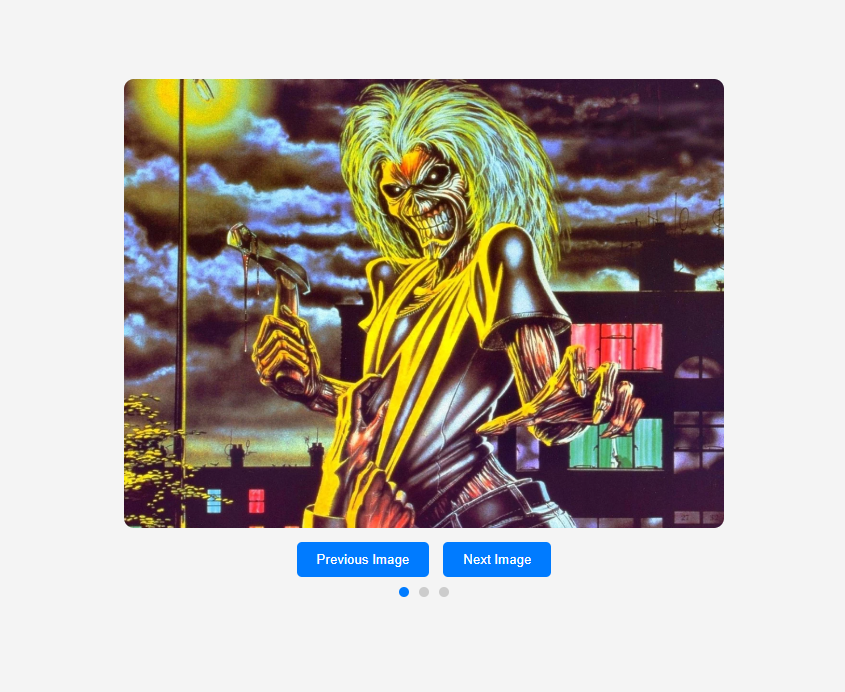

## Events, forms

Your task is to create a web slider for displaying images on a web page. The slider should allow switching between images and display them in the center of the screen.

1. Create a web page interface that includes the following elements:

a. A container for displaying the current image.

b. "Previous Image" and "Next Image" buttons for switching between images.

c. Navigation dots (indicators) for quickly switching between images.

2. Use HTML to create the interface elements.

3. Use JavaScript to handle events:

a. When the "Previous Image" button is clicked, the previous image should be displayed.
b. When the "Next Image" button is clicked, the next image should be displayed.
c. When the navigation dots are clicked, the slider should switch to the corresponding image.

4. The slider should cycle between images, that is, after the last image, the first one should be displayed, and vice versa.

5. Add styling to the slider and interface elements using CSS to improve the appearance.

## Solution

1. We create [HTML structure](./index.html) for the slider.
2. Added [images](./images/) for the slider
3. Added [JavaScript](./script.js) to handle events
4. Added [styling](./CSS/style.css) to the slider and interface elements using CSS to improve the appearance.
5. launch the server:

